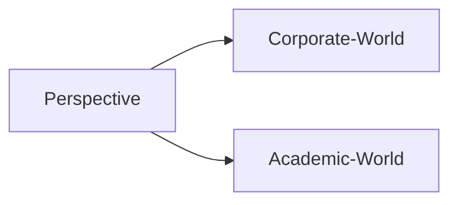

 
>  2022
> **Video:** [1. Intro to problem solving](https://youtu.be/OFm2CIReeyA)

Majority of that is already learned in the courses so what we are going to do here is how do we convert that those concepts you learned into skill because skill is what being tested in these companies.

When you go through a coding interview, coding interview is not just test of your data structure algorithm's knowledge so such testing of your knowledge is called computer science fundamentals interviews there predominantly you get asked question on operating systems, compiler design and things like that but when comes to DSA normally they don't asked question there because in these rounds you have to solve problems algorithmically and show your skill.

```ad-question
Whenever we are discussing of any problems in these Elite session it is about **"what if you get this problem in an interview and that is the first time you see the problem how do you solve it?"**
```

- If you already know the solution to that problem then that is not a good problem to kind of you know, **consider** because you are expected to solve a problem you have never solve it. That's why you solving like you know 500 problems is not the solution right.
- So that is how you should look at this whole approach of you know the preparation because the skill is **can you solve a problem you haven't solved before**. Okay

```ad-tip
Focus on what I try to say there instead of you know just looking at the solution to the problem look at **What is that method** and **What is that approach to solving a problem**.
```

- **Approach** is the most important because when you face an interview you are assist to see whether you can become a good engineer or not. It's a very abstract idea right. Okay

Why I wanted to introduce myself is it's not like I want to brag about, you know what I have done and what I know more than that I just wanted to show you that you know "I can really help you guys" right, **you can use me to prepare** right, so that is the whole purpose I'm showing here.



- I started thinking about - How can someone really solve a problem from Scratch. Whatever the methods I used I didn't really know actually what exactly the method I used that's why you see lot of people do YouTube videos and all when they crack the interview they're gonna just explain how did they do it but they are not the methods that you can exactly capture because it is just for them how did they solve it. **"YouTube videos is just for them"**. But when you see a problem for the first time how do you approach solving it.

I strongly hope that you can make best use of me and you know get the best of these available jobs so it's just a matter of you getting an interview call after that you should be crack it right. So that's why do not waste any of those opportunities when you get a call it should not be just like you know you throwing a stone in dark you should be very known as in when you get a stone in your hand you should be able to **throw it properly** that's what is analogy I want to share.
So that's why follow these principles and you should be able to crack any interview even Google interview or Microsoft or Adobe  whatever company you name it you can crack it none of them unreachable to you. You don't have to think okay that is out of my league I cannot crack such interviews no none of them too hard

If you figure out all the techniques because whenever I see a problem many problems are very familiar to me but I don't try to use that to solve a problem, **familiarity I just forget it and I try to solve from scratch right**.

```ad-important
Do not make the mistake of you remembering solutions of the problems you solved.
**"Don't remember the solution of the problems"**
```

- When you solve a problem or when you see someone else solving a problem like me or someone else. You focus on the method they are using right. **Learn the method**, do not learn these solution itself, that's why do not depend on the YouTube videos which explain solution of a problem even if you do that you focus on what is the method they used, How did they come to this point. How did this idea come to their mind that is what you need to think of.

Don't just look for "How does this work?", how does dijekstra algorithm work, you know dijekstra algorithm to find the shortest path in a graph (single source shortest path algorithm).

- How did someone come with binary search tree right how did someone get an idea which is going to amazing to kind of hold a bunch of elements where we can insert a delete and search for an element in O of logn time right so those are things **you need to wonder not just you know how it works** Okay.

```ad-hint
Go on any platform & solve them and then try to learn and when you solve **don't try to remember solution** just focus on what is the method you're using.
```

1. Follow **Leetcode**
2. Follow **InterviewBit**

Don't mistake for "okay, these are just easy problems I know the solution to it" **focus on approach** because once you get the approach right then when you go to harder problems with harder concepts you will be able to catch them right, so they are not isolated it's like a one big flowchart you have in your mind, when you see a problem "okay this is what I understood so because of that, I'm gonna go this way, otherwise this way" so it should be like a your whole problem solving approach should be like a one big flowchart right, they are not independent.

When you see a problem you should not look for "okay, is this problem familiar to me or have I solve a similar problem" don't do that lots of people do that. It is not the best way to do it, right. That's why just don't go by someone who says "I cracked Google interview and this is what I did" and don't try to follow that. When they say that, not many people are going to understand their learning process itself.

And again don't make the mistake of okay I know an efficient solution let me give you that right. So try not to do that, just **show how I solve it If I see this problem for the first time**, try to show the method here, right.

