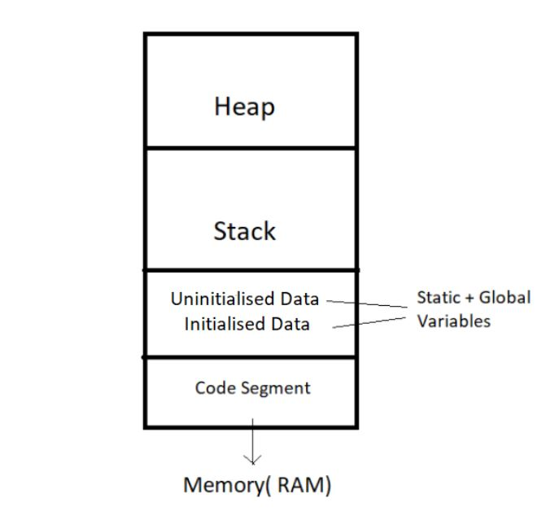

# Introduction

## What is Data Structure?
* Data Structures are ingredients to make efficient algorithm.
* It ways to arrange data in main memory(RAM) so that they(data items) can be used efficiently.
* ##### Examples :
    * Arrays, Linked List, Stack, Queue, Binary Search Tree, Graph e.t.c

## What is an Algorithm?
* Sequence of steps performed on the data using efficient data structures to solve a given problem.
* ##### Example in lay man :
    * Preparing to make Chai
* ##### Example :
    * Sorting an array $ 1,7,9,2 -> 1,2,7,9 $

# Terminologies :
## Database -
* Collection of information in permanent storage for faster retrieval and updation
* Data retrieve/read/delete in HDD
* ##### Example :
    * MySQL, MangoDB
## Data Warehouse -
* Management of huge amount of legacy data for  better analysis.
* Legacy data are kept separate from main storage

## Big Data -
* Analysis of too large or complex data, which cannot be dealt with the traditional data processing applications.
* ##### Example :
    * Search Engine

## How to load a program in RAM -
* When the program starts, its code gets copied to the main memory
* These different section in RAM
    * `Heap`
    * `Stack`
    * `Static + Global` variables
    * `Code Section`
* **Stack -** It holds the memory occupied by functions. It stores the activation records of the functions used in the program. And erases them as they get executed.
* **Heap -** It contains the data which is requested by the program as dynamic memory using pointers.
* **Static Global variables -** segments hold initialized and uninitialized global variables, respectively.
* When you don't free the heap recursively then it called as **Memory Leak** 

# Extra Knowledge :
* **RAM** stands for Random Access Memory.
* **HDD** Stands for Hard Disk Drive.
* **Legacy Data -** Social User data store by a company( the data we keep at a different place from our fresh data in the database to make the process of retrieval and updation fast)