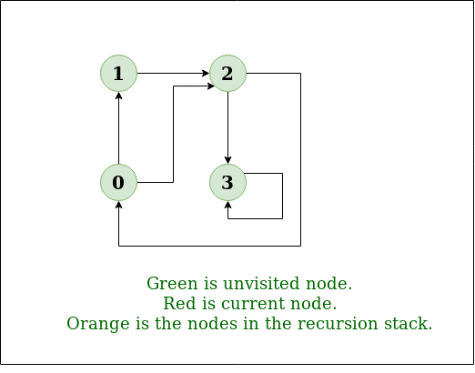

# 1. Breadth First Search for a Graph

The breadth-first search (BFS) algorithm is used to search a tree or graph data structure for a node that meets a set of criteria. It starts at the tree’s root or graph and searches/visits all nodes at the current depth level before moving on to the nodes at the next depth level. Breadth-first search can be used to solve many problems in graph theory.

The only catch here is, that, unlike trees, graphs may contain cycles, so we may come to the same node again. To avoid processing a node more than once, we divide the vertices into two categories:

- Visited and
- Not visited.

A boolean visited array is used to mark the visited vertices. For simplicity, it is assumed that all vertices are reachable from the starting vertex. BFS uses a queue data structure for traversal.

__Example:__

In the following graph, we start traversal from vertex 2.


When we come to vertex 0, we look for all adjacent vertices of it. 

- 2 is also an adjacent vertex of 0. 
- If we don’t mark visited vertices, then 2 will be processed again and it will become a non-terminating process.

There can be multiple BFS traversals for a graph. Different BFS traversals for the above graph :

2, 3, 0, 1
2, 0, 3, 1

## Implementation of BFS traversal on Graph:

__Pseudo Code:__

```cpp
Breadth_First_Search( Graph, X ) // Here, Graph is the graph that we already have and X is the source node

Let Q be the queue
Q.enqueue( X ) // Inserting source node X into the queue
Mark X node as visited.

While ( Q is not empty )
Y = Q.dequeue( ) // Removing the front node from the queue

Process all the neighbors of Y, For all the neighbors Z of Y
If Z is not visited, Q. enqueue( Z ) // Stores Z in Q
Mark Z as visited
```

Follow the below method to implement BFS traversal.

- Declare a queue and insert the starting vertex.
- Initialize a visited array and mark the starting vertex as visited.
- Follow the below process till the queue becomes empty:
  - Remove the first vertex of the queue.
  - Mark that vertex as visited.
  - Insert all the unvisited neighbors of the vertex into the queue.

__Illustration:__

1. __Step1:__ Initially queue and visited arrays are empty.


> Queue and visited arrays are empty initially.

2. __Step2:__ Push node 0 into queue and mark it visited.


> Push node 0 into queue and mark it visited.

3. __Step 3:__ Remove node 0 from the front of queue and visit the unvisited neighbours and push them into queue.


> Remove node 0 from the front of queue and visited the unvisited neighbours and push into queue.

4. __Step 4:__ Remove node 1 from the front of queue and visit the unvisited neighbours and push them into queue.


> Remove node 1 from the front of queue and visited the unvisited neighbours and push.

5. __Step 5:__ Remove node 2 from the front of queue and visit the unvisited neighbours and push them into queue.


> Remove node 2 from the front of queue and visit the unvisited neighbours and push them into queue.

6. __Step 6:__ Remove node 3 from the front of queue and visit the unvisited neighbours and push them into queue. 

As we can see that every neighbours of node 3 is visited, so move to the next node that are in the front of the queue.


> Remove node 3 from the front of queue and visit the unvisited neighbours and push them into queue. 

7. __Steps 7:__ Remove node 4 from the front of queue and visit the unvisited neighbours and push them into queue. 

As we can see that every neighbours of node 4 are visited, so move to the next node that is in the front of the queue.


> Remove node 4 from the front of queue and visit the unvisited neighbours and push them into queue.

Now, Queue becomes empty, So, terminate these process of iteration.


The implementation uses an adjacency list representation of graphs. STL‘s list container stores lists of adjacent nodes and the queue of nodes needed for BFS traversal.

```py
# print BFS traversal from a given source vertex.
# BFS(int s) traverses vertices reachable from s.
from collections import defaultdict

# This class represents a directed graph using adjacency list representation
class Graph:
    # Constructor
    def __init__(self) -> None:
        # Default dictionary to store graph
        self.graph = defaultdict(list)
    
    # function to add an edge to graph
    def addEdge(self, u, v):
        self.graph[u].append(v)
    
    # Function to print a BFS of graph
    def BFS(self, source):
        # Mark all the vertices as not visited
        visited = [False] * (max(self.graph) + 1)
        # Create a queue for BFS
        queue = []
        # Mark the source node as visited and enqueue it
        queue.append(source)
        visited[source] = True
        
        while queue:
            # Dequeue a vertex from queue and print it
            node = queue.pop(0)
            print(node, end=' ')
            # Get all adjacent vertices of the dequeued vertex s. If a adjacent
            # has not been visited, then mark it visited and enqueue it.
            for i in self.graph[node]:
                if visited[i] == False:
                    queue.append(i)
                    visited[i] = True

if __name__ == '__main__':
    g = Graph()
    g.addEdge(0, 1)
    g.addEdge(0, 2)
    g.addEdge(1, 2)
    g.addEdge(2, 0)
    g.addEdge(2, 3)
    g.addEdge(3, 3)
    print("Following is Breadth First Traversal (starting from vertex 2)")
    g.BFS(2)
```

```yml
Output:
Following is Breadth First Traversal (starting from vertex 2) 
2 0 3 1 
```

__Time Complexity:__ O(V+E), where V is the number of nodes and E is the number of edges.
__Auxiliary Space:__ O(V)

## BFS for Disconnected Graph:

Note that the above code traverses only the vertices reachable from a given source vertex. In every situation, all the vertices may not be reachable from a given vertex (i.e. for a disconnected graph).

```yml
To print all the vertices, we can modify the BFS function to do traversal starting from all nodes one by one (Like the DFS modified version). 
```

Below is the implementation for BFS traversal for the entire graph (valid for directed as well as undirected graphs) with possible multiple disconnected components:

```py
'''
Generic Function for BFS traversal of a Graph (valid for directed as well as undirected graphs which can have multiple disconnected components)
-- Inputs --

-> V - represents number of vertices in the Graph
-> adj[] - represents adjacency list for the Graph

-- Output --
-> bfs_traversal - a vector containing bfs traversal for entire graph
'''

def bfs(V, adj):
    bfs_traversal = []
    vis = [False] * V
    for i in range(V):
        # To check if already visited
        if vis[i] == False:
            q = []
            vis[i] = True
            q.append(i)
            # BFS starting from ith node
            while len(q) > 0:
                g_node = q.pop(0)
                bfs_traversal.append(g_node)
                for it in adj[g_node]:
                    if vis[it] == False:
                        vis[it] = True
                        q.append(it)
    return bfs_traversal
```

__Time Complexity:__ O(V+E)
Where V is the number of vertices and E is the number of edges in the graph.

__Space Complexity:__ O(V)
We used an array of size V to store the BFS traversal. We also used an array of size V to keep track of visited vertices. We used a queue of size V to store the vertices.

## Problems related to BFS:

|S.no|Problems|Practice|
|1.|Find the level of a given node in an Undirected Graph|Link|
|2.|Minimize maximum adjacent difference in a path from top-left to bottom-right|Link|
|3.|Minimum jump to the same value or adjacent to reach the end of an Array|Link|
|4.|Maximum coin in minimum time by skipping K obstacles along the path in Matrix|Link|
|5.|Check if all nodes of the Undirected Graph can be visited from the given Node|Link|
|6.|Minimum time to visit all nodes of a given Graph at least once|Link|
|7.|Minimize moves to the next greater element to reach the end of the Array|Link|
|8.|Shortest path by removing K walls|Link|
|9.|Minimum time required to infect all the nodes of the Binary tree|Link|
|10.|Check if destination of given Matrix is reachable with required values of cells|Link|

## Applications of BFS:

- __Shortest Path and Minimum Spanning Tree for unweighted graph:__ In an unweighted graph, the shortest path is the path with the least number of edges. With Breadth First, we always reach a vertex from a given source using the minimum number of edges. Also, in the case of unweighted graphs, any spanning tree is Minimum Spanning Tree and we can use either Depth or Breadth first traversal for finding a spanning tree. 
- __Peer-to-Peer Networks:__ In Peer-to-Peer Networks like BitTorrent, Breadth First Search is used to find all neighbor nodes. 
- __Crawlers in Search Engines:__ Crawlers build an index using Breadth First. The idea is to start from the source page and follow all links from the source and keep doing the same. Depth First Traversal can also be used for crawlers, but the advantage of Breadth First Traversal is, the depth or levels of the built tree can be limited. 
- __Social Networking Websites:__ In social networks, we can find people within a given distance ‘k’ from a person using Breadth First Search till ‘k’ levels. 
- __GPS Navigation systems:__ Breadth First Search is used to find all neighboring locations. 
- __Broadcasting in Network:__ In networks, a broadcasted packet follows Breadth First Search to reach all nodes. 
- __In Garbage Collection:__ Breadth First Search is used in copying garbage collection using Cheney’s algorithm. Refer this and for details. Breadth First Search is preferred over Depth First Search because of the better locality of reference: 
- __Cycle detection in the undirected graph:__ In undirected graphs, either Breadth First Search or Depth First Search can be used to detect cycle. We can use BFS to detect cycle in a directed graph also,
- __Ford–Fulkerson algorithm:__ In the Ford-Fulkerson algorithm, we can either use Breadth First or Depth First Traversal to find the maximum flow. Breadth First Traversal is preferred as it reduces worst-case time complexity to O(VE2). 
- __To test if a graph is Bipartite:__ We can either use Breadth First or Depth First Traversal. 
- __Path Finding:__ We can either use Breadth First or Depth First Traversal to find if there is a path between two vertices. 
- __Finding all nodes within one connected component:__ We can either use Breadth First or Depth First Traversal to find all nodes reachable from a given node. 

## Advantages of Breadth First Search:

- BFS will never get trapped exploring the useful path forever.
- If there is a solution, BFS definitely find it out.
- If there is more than one solution then BFS can find the minimal one that requires less number of steps. If there is a solution then BFS is guaranteed to find it.
- Low storage requirement: linear with depth.
- Easily programmed.

##  Disadvantages of Breadth First Search:

The main drawback of BFS is its memory requirement. Since each level of the tree must be saved in order to generate the next level and the amount of memory is proportional to the number of nodes stored the space complexity of BFS is O(bd ). As a result, BFS is severely space-bound in practice so will exhaust the memory available on typical computers in a matter of minutes.

# 2. Depth First Search for a Graph

Depth First Traversal (or Search) for a graph is similar to Depth First Traversal of a tree. The only catch here is, that, unlike trees, graphs may contain cycles (a node may be visited twice). To avoid processing a node more than once, use a boolean visited array. A graph can have more than one DFS traversal.

__Example:__

```yml
Input: n = 4, e = 6 
0 -> 1, 0 -> 2, 1 -> 2, 2 -> 0, 2 -> 3, 3 -> 3 
Output: DFS from vertex 1 : 1 2 0 3 
Explanation: 
DFS Diagram: 
```



```yml
Input: n = 4, e = 6 
2 -> 0, 0 -> 2, 1 -> 2, 0 -> 1, 3 -> 3, 1 -> 3 
Output: DFS from vertex 2 : 2 0 1 3 
Explanation: 
DFS Diagram: 
```


[DFS of Graph - GFG Practice]()


```yml
Depth-first search is an algorithm for traversing or searching tree or graph data structures. The algorithm starts at the root node (selecting some arbitrary node as the root node in the case of a graph) and explores as far as possible along each branch before backtracking. 

So the basic idea is to start from the root or any arbitrary node and mark the node and move to the adjacent unmarked node and continue this loop until there is no unmarked adjacent node. Then backtrack and check for other unmarked nodes and traverse them. Finally, print the nodes in the path.
```

Follow the below steps to solve the problem:

- Create a recursive function that takes the index of the node and a visited array.
- Mark the current node as visited and print the node.
- Traverse all the adjacent and unmarked nodes and call the recursive function with the index of the adjacent node.

Below is the implementation of the above approach:

```py
# Print DFS traversal from a given graph
from collections import defaultdict

# This class represents a directed graph using adjacency list representation


class Graph:

	# Constructor
	def __init__(self):

		# default dictionary to store graph
		self.graph = defaultdict(list)

	# function to add an edge to graph
	def addEdge(self, u, v):
		self.graph[u].append(v)

	# A function used by DFS
	def DFSUtil(self, v, visited):

		# Mark the current node as visited and print it
		visited.add(v)
		print(v, end=' ')

		# Recur for all the vertices adjacent to this vertex
		for neighbour in self.graph[v]:
			if neighbour not in visited:
				self.DFSUtil(neighbour, visited)

	# The function to do DFS traversal. It uses recursive DFSUtil()
	def DFS(self, v):

		# Create a set to store visited vertices
		visited = set()

		# Call the recursive helper function to print DFS traversal
		self.DFSUtil(v, visited)

# Driver's code
if __name__ == "__main__":
	g = Graph()
	g.addEdge(0, 1)
	g.addEdge(0, 2)
	g.addEdge(1, 2)
	g.addEdge(2, 0)
	g.addEdge(2, 3)
	g.addEdge(3, 3)

	print("Following is DFS from (starting from vertex 2)")
	g.DFS(2)
```

```yml
Output:

Following is Depth First Traversal (starting from vertex 2) 
2 0 1 3 
```

__Time complexity:__ O(V + E), where V is the number of vertices and E is the number of edges in the graph.
__Auxiliary Space:__ O(V), since an extra visited array of size V is required.

## Handling A Disconnected Graph:

>     This will happen by handling a corner case. The above code traverses only the vertices reachable from a given source vertex. All the vertices may not be reachable from a given vertex, as in a Disconnected graph. To do a complete DFS traversal of such graphs, run DFS from all unvisited nodes after a DFS. The recursive function remains the same.

Follow the below steps to solve the problem:

- Create a recursive function that takes the index of the node and a visited array.
- Mark the current node as visited and print the node.
- Traverse all the adjacent and unmarked nodes and call the recursive function with the index of the adjacent node.
- Run a loop from 0 to the number of vertices and check if the node is unvisited in the previous DFS, then call the recursive function with the current node.

Below is the implementation of the above approach:

```py
'''Program to print DFS traversal for complete graph'''
from collections import defaultdict

# this class represents a directed graph using adjacency list representation


class Graph:
	# Constructor
	def __init__(self):
		# default dictionary to store graph
		self.graph = defaultdict(list)

	# Function to add an edge to graph
	def addEdge(self, u, v):
		self.graph[u].append(v)
	# A function used by DFS

	def DFSUtil(self, v, visited):
		# Mark the current node as visited and print it
		visited.add(v)
		print(v, end=" ")

	# recur for all the vertices adjacent to this vertex
		for neighbour in self.graph[v]:
			if neighbour not in visited:
				self.DFSUtil(neighbour, visited)
	# The function to do DFS traversal. It uses recursive DFSUtil

	def DFS(self):
		# create a set to store all visited vertices
		visited = set()
        # call the recursive helper function to print DFS traversal starting from all vertices one by one
		for vertex in self.graph:
			if vertex not in visited:
				self.DFSUtil(vertex, visited)


# Driver's code
if __name__ == "__main__":
	print("Following is Depth First Traversal \n")
	g = Graph()
	g.addEdge(0, 1)
	g.addEdge(0, 2)
	g.addEdge(1, 2)
	g.addEdge(2, 0)
	g.addEdge(2, 3)
	g.addEdge(3, 3)
	g.DFS()
```

```yml
Output:

Following is Depth First Traversal 
0 1 2 3 
```

__Time complexity:__ O(V + E), where V is the number of vertices and E is the number of edges in the graph.
__Auxiliary Space:__ O(V), since an extra visited array of size V is required.

## Advantages of Depth First Search:

- Memory requirement is only linear with respect to the search graph. This is in contrast with breadth-first search which requires more space. The reason is that the algorithm only needs to store a stack of nodes on the path from the root to the current node.
- The time complexity of a depth-first Search to depth d is O(bd) since it generates the same set of nodes as breadth-first search, but simply in a different order. Thus practically depth-first search is time-limited rather than space-limited.
- If depth-first search finds solution without exploring much in a path then the time and space it takes will be very less.
- DFS requires less memory since only the nodes on the current path are stored. By chance DFS may find a solution without examining much of the search space at all.

## Disadvantages of Depth First Search:

- The disadvantage of Depth-First Search is that there is a possibility that it may down the left-most path forever. Even a finite graph can generate an infinite tre One solution to this problem is to impose a cutoff depth on the search. Although ideal cutoff is the solution depth d and this value is rarely known in advance of actually solving the problem. If the chosen cutoff depth is less than d, the algorithm will fail to find a solution, whereas if the cutoff depth is greater than d, a large price is paid in execution time, and the first solution found may not be an optimal one.
- Depth-First Search is not guaranteed to find the solution.
- And there is no guarantee to find a minimal solution, if more than one solution.

## Applications of DFS.

Breadth-First Traversal for a Graph

# 3. Applications of Depth First Search

In this article we will deep dive into the world of application of Depth-First Search (DFS), the algorithm that traverses the depth of a graph before exploring its breadth. From topological sorting to pathfinding, cycle detection to maze generation, DFS is a versatile tool for solving a wide range of problems.
Following are the problems that use DFS as a building block.

1. __Detecting cycle in a graph:__
A graph has cycle if and only if we see a back edge during DFS. So we can run DFS for the graph and check for back edges. (See this for details) 

2. __Path Finding:__
We can specialize the DFS algorithm to find a path between two given vertices u and z. 
   - Call DFS(G, u) with u as the start vertex. 
   - Use a stack S to keep track of the path between the start vertex and the current vertex. 
   - As soon as destination vertex z is encountered, return the path as the 
contents of the stack 

3. __Topological Sorting:__ 
Topological Sorting is mainly used for scheduling jobs from the given dependencies among jobs. In computer science, applications of this type arise in instruction scheduling, ordering of formula cell evaluation when recomputing formula values in spreadsheets, logic synthesis, determining the order of compilation tasks to perform in makefiles, data serialization, and resolving symbol dependencies in linkers [2]. 

4. __To test if a graph is bipartite:__
We can augment either BFS or DFS when we first discover a new vertex, color it opposite its parents, and for each other edge, check it doesn’t link two vertices of the same color. The first vertex in any connected component can be red or black! See this for details. 

5. __Finding Strongly Connected Components of a graph:__ A directed graph is called strongly connected if there is a path from each vertex in the graph to every other vertex. (See this for DFS-based algo for finding Strongly Connected Components) 

6. __Solving puzzles with only one solution:__, such as mazes. (DFS can be adapted to find all solutions to a maze by only including nodes on the current path in the visited set.) 

7. __Web crawlers:__ Depth-first search can be used in the implementation of web crawlers to explore the links on a website.

8. __Maze generation:__ Depth-first search can be used to generate random mazes.

9. __Model checking:__ Depth-first search can be used in model checking, which is the process of checking that a model of a system meets a certain set of properties.

10. __Backtracking:__ Depth-first search can be used in backtracking algorithms.

# 4. Applications of Breadth First Traversal

We have earlier discussed Breadth First Traversal Algorithm for Graphs. We have also discussed Applications of Depth First Traversal. In this article, applications of Breadth First Search are discussed. 

1. __Shortest Path and Minimum Spanning Tree for unweighted graph:__ In an unweighted graph, the shortest path is the path with least number of edges. With Breadth First, we always reach a vertex from given source using the minimum number of edges. Also, in case of unweighted graphs, any spanning tree is Minimum Spanning Tree and we can use either Depth or Breadth first traversal for finding a spanning tree. 
2. __Peer to Peer Networks:__ In Peer to Peer Networks like BitTorrent, Breadth First Search is used to find all neighbor nodes. 
3. __Crawlers in Search Engines:__ Crawlers build index using Breadth First. The idea is to start from source page and follow all links from source and keep doing same. Depth First Traversal can also be used for crawlers, but the advantage with Breadth First Traversal is, depth or levels of the built tree can be limited. 
4. __Social Networking Websites:__ In social networks, we can find people within a given distance ‘k’ from a person using Breadth First Search till ‘k’ levels. 
5. __GPS Navigation systems:__ Breadth First Search is used to find all neighboring locations. 
6. Broadcasting in Network: In networks, a broadcasted packet follows Breadth First Search to reach all nodes. 
7. __In Garbage Collection:__ Breadth First Search is used in copying garbage collection using Cheney’s algorithm. Refer this and for details. Breadth First Search is preferred over Depth First Search because of better locality of reference: 
8. __Cycle detection in undirected graph:__ In undirected graphs, either Breadth First Search or Depth First Search can be used to detect cycle. We can use BFS to detect cycle in a directed graph also,
9. __Ford–Fulkerson algorithm:__ In Ford-Fulkerson algorithm, we can either use Breadth First or Depth First Traversal to find the maximum flow. Breadth First Traversal is preferred as it reduces worst case time complexity to O(VE2). 
10. __To test if a graph is Bipartite:__ We can either use Breadth First or Depth First Traversal. 
11. __Path Finding:__ We can either use Breadth First or Depth First Traversal to find if there is a path between two vertices. 
12. __Finding all nodes within one connected component:__ We can either use Breadth First or Depth First Traversal to find all nodes reachable from a given node. 
13. __AI:__ In AI, BFS is used in traversing a game tree to find the best move.
14. __Network Security:__ In the field of network security, BFS is used in traversing a network to find all the devices connected to it.
15. Undirected graph: Finding all connected components in an undirected graph.
16. __Topological sorting:__ BFS can be used to find a topological ordering of the nodes in a directed acyclic graph (DAG).
17. __Image processing:__ BFS can be used to flood fill an image with a particular color or to find connected components of pixels.
18. __Recommender systems:__ BFS can be used to find similar items in a large dataset by traversing the items’ connections in a similarity graph.

Many algorithms like Prim’s Minimum Spanning Tree and Dijkstra’s Single Source Shortest Path use structure similar to Breadth First Search. 

# 5. Iterative Depth First Traversal of Graph

Depth First Traversal (or Search) for a graph is similar to Depth First Traversal (DFS) of a tree. The only catch here is, unlike trees, graphs may contain cycles, so a node might be visited twice. To avoid processing a node more than once, use a boolean visited array. 

__Example:__

```yml
Input: n = 4, e = 6 
0 -> 1, 0 -> 2, 1 -> 2, 2 -> 0, 2 -> 3, 3 -> 3 
Output: DFS from vertex 1 : 1 2 0 3 
Explanation: 
DFS Diagram: 
```


