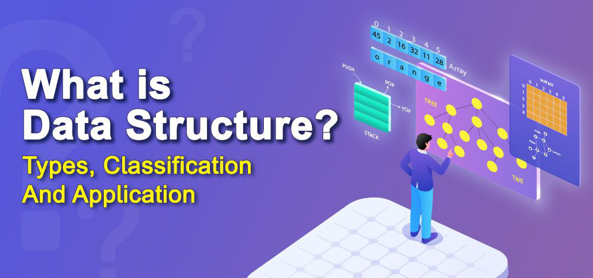
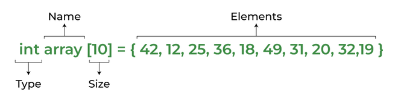
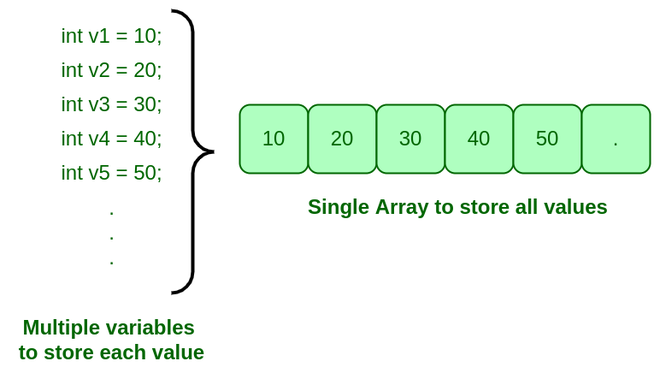
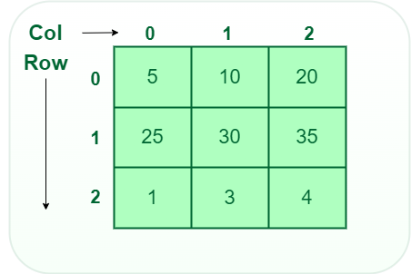
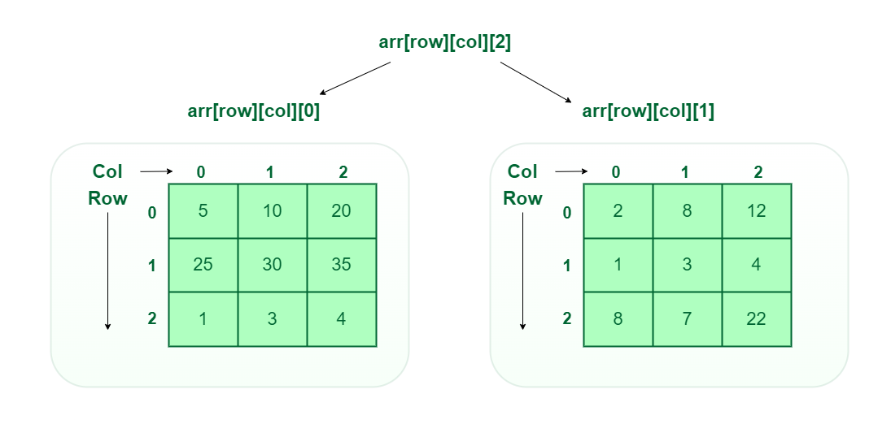

# Chapter 1: Introduction to Data Structures

#### What is Data Structure:

A data structure is a storage that is used to store and organize data. It is a way of arranging data on a computer so that it can be accessed and updated efficiently.

- A data structure is not only used for organizing the data. It is also used for processing, retrieving, and storing data. There are different basic and advanced types of data structures that are used in almost every program or software system that has been developed. So we must have good knowledge about data structures.
- Data structures are an integral part of computers used for the arrangement of data in memory. They are essential and responsible for organizing, processing, accessing, and storing data efficiently. But this is not all. Various types of data structures have their own characteristics, features, applications, advantages, and disadvantages.
  - So how do you identify a data structure that is suitable for a particular task?
  - What is meant by the term ‘Data Structure’?
  - How many types of data structures are there and what are they used for?



#### How Data Structure varies from Data Type:

We already have learned about data structure. Many times, what happens is that people get confused between data type and data structure. So let’s see a few differences between data type and data structure to make it clear.

|Data Types|Data Structure|
|---|---|
|The data type is the form of a variable to which a value can be assigned. It defines that the particular variable will assign the values of the given data type only.|Data structure is a collection of different kinds of data. That entire data can be represented using an object and can be used throughout the program.|
|It can hold value but not data. Therefore, it is dataless.|It can hold multiple types of data within a single object.|
|The implementation of a data type is known as abstract implementation.|Data structure implementation is known as concrete implementation.|
|There is no time complexity in the case of data types.|In data structure objects, time complexity plays an important role.|
|In the case of data types, the value of data is not stored because it only represents the type of data that can be stored.|While in the case of data structures, the data and its value acquire the space in the computer’s main memory. Also, a data structure can hold different kinds and types of data within one single object.|
|Data type examples are int, float, double, etc.|Data structure examples are stack, queue, tree, etc.|

#### Classification of Data Structure: 


- __Linear data structure:__ Data structure in which data elements are arranged sequentially or linearly, where each element is attached to its previous and next adjacent elements, is called a linear data structure. Examples of linear data structures are array, stack, queue, linked list, etc.
  - __Static data structure:__ Static data structure has a fixed memory size. It is easier to access the elements in a static data structure. Example - Array.
  - __Dynamic data structure:__ In dynamic data structure, the size is not fixed. It can be randomly updated during the runtime which may be considered efficient concerning the memory (space) complexity of the code. Examples are queue, stack, etc.
- __Non-linear data structure:__ Data structures where data elements are not placed sequentially or linearly are called non-linear data structures. In a non-linear data structure, we can’t traverse all the elements in a single run only. Examples are trees and graphs.

For example, we can store a list of items having the same data-type using the array data structure.

#### Need Of Data structure :

The structure of the data and the synthesis of the algorithm are relative to each other. Data presentation must be easy to understand so the developer, as well as the user, can make an efficient implementation of the operation.
Data structures provide an easy way of organizing, retrieving, managing, and storing data.
Here is a list of the needs for data.

- Data structure modification is easy. 
- It requires less time. 
- Save storage memory space. 
- Data representation is easy. 
- Easy access to the large database.

# Chapter 2: Arrays

- An array is a collection of items stored at contiguous memory locations. The idea is to store multiple items of the same type together. This makes it easier to calculate the position of each element by simply adding an offset to a base value, i.e., the memory location of the first element of the array (generally denoted by the name of the array).
- Array is a linear data structure that is a collection of similar data types.
- Arrays are stored in contiguous memory locations.
- It is a static data structure with a fixed size. It combines data of similar types.


### Applications of Array Data Structure:

- Arrays are used to implement data structures like a stack, queue, etc.
- Arrays are used for matrices and other mathematical implementations.
- Arrays are used in lookup tables in computers.
- Arrays can be used for CPU scheduling.

### Real-Time Applications of Array:

- Contact lists on mobile phones.
- Matrices use arrays which are used in different fields like image processing, computer graphics, and many more.
- Arrays are used in online ticket booking portals.
- Pages of book.
- IoT applications use arrays as we know that the number of values in an array will remain constant, and also that the accessing will be faster.
- It is also utilised in speech processing, where each speech signal is represented by an array.
- The viewing screen of any desktop/laptop is also a multidimensional array of pixels.

### Advantages of array data structure:

- Arrays store multiple data of similar types with the same name.
- It allows random access to elements.
- As the array is of fixed size and stored in contiguous memory locations there is no memory shortage or overflow.
- It is helpful to store any type of data with a fixed size.
- Since the elements in the array are stored at contiguous memory locations it is easy to iterate in this data structure and unit time is required to access an element if the index is known.

### Disadvantages of array data structure:

- The size of the array should be known in advance.
- The array is a static data structure with a fixed size so, the size of the array cannot be modified further and hence no modification can be done during runtime.
- Insertion and deletion operations are costly in arrays as elements are stored in contiguous memory.
- If the size of the declared array is more than the required size then, it can lead to memory wastage. 

## Introduction To Arrays

- An array is a collection of items of the same variable type stored that are stored at contiguous memory locations. It’s one of the most popular and simple data structures and is often used to implement other data structures. Each item in an array is indexed starting with 0.

- The dream of every programmer is to become not just a good, but also a great programmer. We all want to achieve our goals and to achieve our goals, we must have a great plan with us. In this context, we have decided to provide a complete guide for Arrays interview preparation, which will help you to tackle the problems that are mostly asked in the interview, such as What is an Array, What is Array in C language, How do you initialize an Array in C, How to sort an Array, etc. We have also covered the topics such as Top Theoretical interview questions and Top interview coding questions in this complete guide for Array interview preparation.

### Basic terminologies of array

- __Array Index:__ In an array, elements are identified by their indexes. Array index starts from 0.
- __Array element:__ Elements are items stored in an array and can be accessed by their index.
- __Array Length:__ The length of an array is determined by the number of elements it can contain.

### Representation of Array

The representation of an array can be defined by its declaration. A declaration means allocating memory for an array of a given size.


```py
# Python code
arr = [10, 20, 30]  # This array will store integer
arr2 = ['c', 'd', 'e']  # This array will store characters
arr3 = [28.5, 36.5, 40.2]  # This array will store floating elements
```



However, the above declaration is static or compile-time memory allocation, which means that the array element’s memory is allocated when a program is compiled. Here only a fixed size (i,e. the size that is mentioned in square brackets []) of memory will be allocated for storage, but don’t you think it will not be the same situation as we know the size of the array every time, there might be a case where we don’t know the size of the array. If we declare a larger size and store a lesser number of elements will result in a wastage of memory or either be a case where we declare a lesser size then we won’t get enough memory to store the rest of the elements. In such cases, static memory allocation is not preferred.

### Why Array Data Structures is needed?

- Assume there is a class of five students and if we have to keep records of their marks in examination then, we can do this by declaring five variables individual and keeping track of records but what if the number of students becomes very large, it would be challenging to manipulate and maintain the data.
- What it means is that, we can use normal variables (v1, v2, v3, ..) when we have a small number of objects. But if we want to store a large number of instances, it becomes difficult to manage them with normal variables. The idea of an array is to represent many instances in one variable..



### Types of arrays:

- __One-dimensional array (1-D arrays):__ You can imagine a 1d array as a row, where elements are stored one after another. 

- __Two-dimensional array:__ 2-D Multidimensional arrays can be considered as an array of arrays or as a matrix consisting of rows and columns. 
- Three-dimensional array: A 3-D Multidimensional array contains three dimensions, so it can be considered an array of two-dimensional arrays. 

###  Types of Array operations:

- __Traversal:__ Traverse through the elements of an array.
- __Insertion:__ Inserting a new element in an array.
- __Deletion:__ Deleting element from the array.
- __Searching:__  Search for an element in the array.
- __Sorting:__ Maintaining the order of elements in the array.

### Advantages of using Arrays:

- Arrays allow random access to elements. This makes accessing elements by position faster.
- Arrays have better cache locality which makes a pretty big difference in performance.
- Arrays represent multiple data items of the same type using a single name.
- Arrays store multiple data of similar types with the same name.
- Array data structures are used to implement the other data structures like linked lists, stacks, queues, trees, graphs, etc.

### Disadvantages of Array:
- As arrays have a fixed size, once the memory is allocated to them, it cannot be increased or decreased, making it impossible to store extra data if required. An array of fixed size is referred to as a static array. 
- Allocating less memory than required to an array leads to loss of data.
- An array is homogeneous in nature so, a single array cannot store values of different data types. 
- Arrays store data in contiguous memory locations, which makes deletion and insertion very difficult to implement. This problem is overcome by implementing linked lists, which allow elements to be accessed sequentially.  

### Application of Array:

- They are used in the implementation of other data structures such as array lists, heaps, hash tables, vectors, and matrices.
- Database records are usually implemented as arrays.
- It is used in lookup tables by computer.
- It is used for different sorting algorithms such as bubble sort insertion sort, merge sort, and quick sort.


