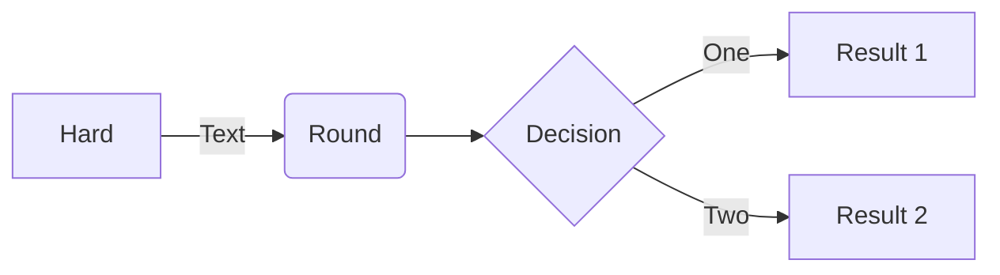
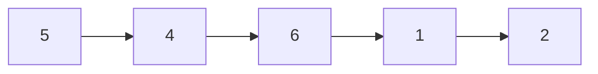

# Data Structure with Python

## 1. Array

### Searching
1. [Linear Search](./Topics)
2. [Binary Search]()

### Sorting
1. 
2. 
3. 





## 2. Recursion
## 3. Linked List
## 4. Stack
## 5. Queue
## 6. Tree
## 7. Graph
## 8. Dynamic Programming
9. 


```mermaid
graph LR
A[Hard edge] -->B(Round edge)
    B --> C{Decision}
    C -->|One| D[Result one]
    C -->|Two| E[Result two]
​```
<!-- 
# A

flowchart LR

A[Hard] -->|Text| B(Round)
B --> C{Decision}
C -->|One| D[Result 1]
C -->|Two| E[Result 2] -->