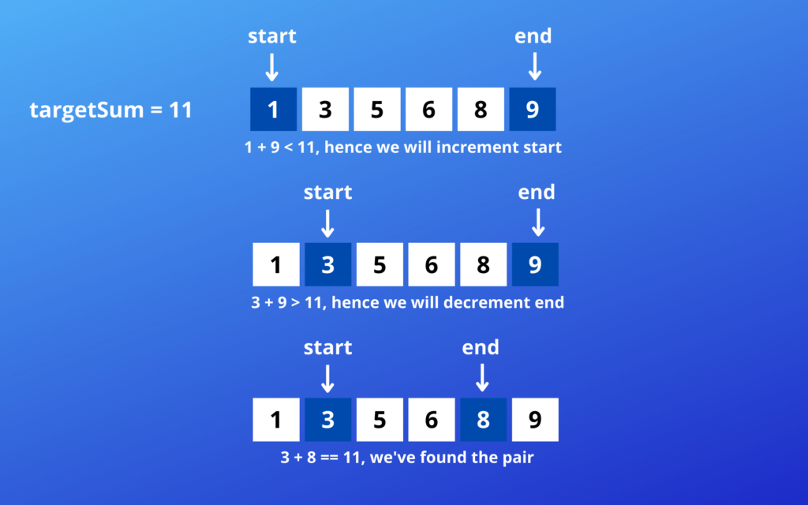
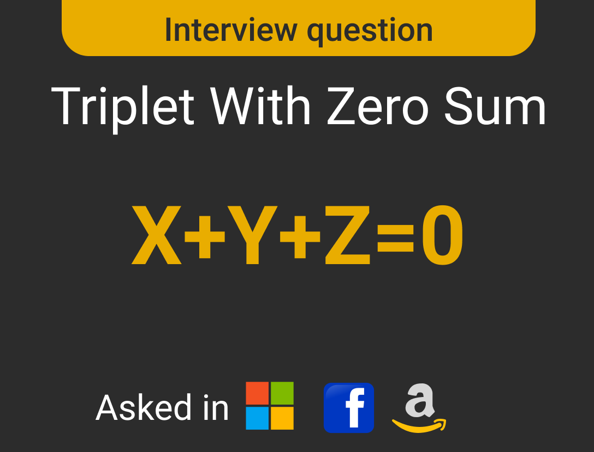

# Two Pointer

- Sorted array or linked list will be given.
- You will need to calculate some specific numbers that matches some value.
- The set of elements could be a pair, a triplet or even a subarray.

- [Two Pointer](#two-pointer)
  - [Q.1 Pair with target sum](#q1-pair-with-target-sum)
    - [Approach 1 : Brute Force](#approach-1--brute-force)
    - [Code -](#code--)
    - [Approach 2 : Optimize version](#approach-2--optimize-version)
    - [Code -](#code---1)
  - [Q.2 Squaring a sorted array so that it will be sorted array](#q2-squaring-a-sorted-array-so-that-it-will-be-sorted-array)
    - [Approach 1 : Brute Force](#approach-1--brute-force-1)
    - [Approach 2 : Optimized](#approach-2--optimized)
  - [Q.3 Triplet sum to zero (Unique Triplets)](#q3-triplet-sum-to-zero-unique-triplets)
    - [Approach 1. Brute Force](#approach-1-brute-force)
      - [Example of contain duplicate answer](#example-of-contain-duplicate-answer)
      - [Example of not contain duplicate answers](#example-of-not-contain-duplicate-answers)
    - [Approach 2 : Optimized](#approach-2--optimized-1)
  - [Q.4 Count no. of triplets whose sum less than given target](#q4-count-no-of-triplets-whose-sum-less-than-given-target)
    - [Approach 1 : Brute Force](#approach-1--brute-force-2)
    - [Approach 2 : Optimized](#approach-2--optimized-2)
  - [Q.5 You are given an array nums and a range [a, b] of triplets whose sum lies in that range [a, b]](#q5-you-are-given-an-array-nums-and-a-range-a-b-of-triplets-whose-sum-lies-in-that-range-a-b)
  - [Q.6 `Dutch National Flag` Problem](#q6-dutch-national-flag-problem)
    - [Approach 1: Brute Force](#approach-1-brute-force-1)
    - [Approach 2: Optimized](#approach-2-optimized)
  - [Q.7 Backspace String Compare](#q7-backspace-string-compare)
    - [Approach 1: Brute Force](#approach-1-brute-force-2)
    - [Approach 2: Optimized](#approach-2-optimized-1)
  - [Other Questions Link](#other-questions-link)
- [Advance Mix Topic](#advance-mix-topic)
    - [Note :- Prior Knowledge of](#note---prior-knowledge-of)

## Q.1 Pair with target sum

**Solve on Leetcode -**
| S.No | Question                                                       | Solution | Related Topics | Difficulty |
| ---- | -------------------------------------------------------------- | -------- | -------------- | ---------- |
| 1.   | [167. Two Sum II - Input Array Is Sorted](https://leetcode.com/problems/two-sum-ii-input-array-is-sorted/) |          |     | **Easy** |

- Given an array of sorted numbers
- and a target sum
- find a pair of indices in the array whose sum is equal to the given target.

| 2   | 4   | 7   | 8   | 9   | 12  | 14  |
| --- | --- | --- | --- | --- | --- | --- |
| 0   | 1   | 2   | 3   | 4   | 5   | 6   |

- Target Sum = 13
- Output : [1, 4]

### Approach 1 : Brute Force

- Here the length of the array is 7 iterating for each element (pointed by first pointer) we search second element in remaining elements (pointed by second pointer) -
- 7 (Length) : 6 + 5 + 4 + 3 + 2 + 1
- N (Length) : N-1 + N-2 + N-3 + .... + 2 + 1, So the time complexity calculate as -

- Sum of first (N-1) natural numbers :
  - N : N(N+1)/2
  - N-1 : (N-1)(N-1+1)/2
  - = N(N-1)/2
  - = N<sup>2</sup>/2 - N/2
- **Time Complexity :** O(n<sup>2</sup>)
- **Space Complexity :** O(1)

### Code -

```py
def solve(arr,target):
    for i in range(len(arr)):
        for j in range(i+1,len(arr)):
            if arr[i]+arr[j]==target:
                return [i,j]
    return [-1,-1]

arr = [2,4,8,7,9,12,14]
target = 13
print(solve(arr,target))
```

### Approach 2 : Optimize version

- Why given array is sorted.
- An efficient way would be to start with one pointer in the beginning and another pointer at the end.
- At every step, we will see if the numbers pointed by the two pointers add up to the target sum. If they do not, we will do one of two things:
  - If the sum of the two numbers pointed by the two pointers is greater than the target sum, this means that we need a pair with a smaller sum. We have to add smaller value for that we have to decrement end pointer index.
  - If the sum of the two numbers pointed by the two pointers is less than the target sum, this means that we need a pair with a greater sum. We have to add greater value for that we have to increment start pointer.
- **Time Complexity :** O(n)
- **Space Complexity :** O(1)

<!--  -->


### Code -

```py
def pairSum(arr,target):
    left = 0
    right = len(arr)-1

    while left < right:
        if arr[left] + arr[right] == target:
            return [left,right]
        elif arr[left] + arr[right] < target:
            left += 1
        else:
            right -= 1
    return [-1, -1]

arr = [1, 3, 5, 6, 8, 9]
target = 11
print(pairSum(arr, target))
```

## Q.2 Squaring a sorted array so that it will be sorted array

**Solve on Leetcode -**
| S.No | Question                                                       | Solution | Related Topics | Difficulty |
| ---- | -------------------------------------------------------------- | -------- | -------------- | ---------- |
| 1.   | [977. Squares of a Sorted Array](https://leetcode.com/problems/squares-of-a-sorted-array/) |          |     | **Easy** |

- You are given a sorted array calculate their squares and the array in sorted.

- Example-1

|2|4|7|8|9|12|14|
|--|--|--|--|--|--|--|
|0|1|2|3|4|5|6|

- Answer ->

|4|16|49|64|81|144|196|
|--|--|--|--|--|--|--|
|0|1|2|3|4|5|6|

- Example-2

|-5|-4|-2|0|1|3|4|
|--|--|--|--|--|--|--|
|0|1|2|3|4|5|6|

- Answer ->

|0|1|4|9|16|16|25|
|--|--|--|--|--|--|--|
|0|1|2|3|4|5|6|

### Approach 1 : Brute Force

- Simply calculate squares and store values into the another `ans` array.
- And then sort the array.
- ***Time Complexity :*** O(nlogn)  -> for sorting
- ***Space Complexity :*** O(n)

```py
def squareArr(arr):
    ans = []
    for i in arr:
        ans.append(i*i)
    return sorted(ans)

arr = [-5, -4, -1, 0, 2, 3, 4]
print(squareArr(arr))
```

### Approach 2 : Optimized

- let us take two pointer at start and end of the array.
- **Time Complexity :** O(n)
- **Space Complexity :** O(n)

```py
def square(arr):
    left,right = 0, len(arr)-1
    index = len(arr)-1
    ans = [0]*len(arr)
    while left<=right:
        lsquare = arr[left]**2
        rsquare = arr[right]**2
        if lsquare > rsquare:
            ans[index] = lsquare
            left += 1
        else:
            ans[index] = rsquare
            right -= 1
        index -= 1
    return ans

arr = [-5, -4, -2, 0, 1, 3, 4]
print(square(arr))
```

OR

```py
def squareArr(arr):
    ans = []
    left, right = 0, len(arr)-1
    while left<=right:
        l = arr[left]*arr[left]
        r = arr[right]*arr[right]
        if l>r:
            ans.insert(0,l)
            left += 1
        else:
            ans.insert(0,r)
            right -= 1
    return ans

arr = [-5, -4, -1, 0, 2, 3, 4]
print(squareArr(arr))
```

## Q.3 Triplet sum to zero (Unique Triplets)

| S.No | Question                                                       | Solution | Platform | Related Topics | Difficulty |
| ---- | -------------------------------------------------------------- | -------- | -------- | -------------- | ---------- |
| 1.   | [Find triplets with zero sum](https://leetcode.com/problems/two-sum/) |          | GFG | `Hash Map`     | **Easy** |
| 2.   | [15. 3Sum](https://leetcode.com/problems/3sum/) |          | Leetcode | `Hash Map`     | **Medium** |
| 3.   | [3Sum Closest](https://leetcode.com/problems/3Sum-Closest/) |          | Leetcode | `Hash Map`     | **** |

- Given an unsorted array find all unique triplets in the array which gives the sum of zero.
- The solution set must not contain duplicate triplets.

|-3|0|1|2|-1|1|-2|
|--|--|--|--|--|--|--|
|0|1|2|3|4|5|6|

- **Note :** For answer you must think on pen and paper.
- **Output :** [-3, 1, 2], [-2, 0, 2], [-2, 1, 1], [-1, 0, 1]



### Approach 1. Brute Force

- ***Time Complexity :*** O (n<sup>3</sup>)
- ***Space Complexity :*** O (1) approx

#### Example of contain duplicate answer

```py
def tripletZero(arr):
    n = len(arr)
    ans = set()
    for i in range(n-2):
        for j in range(i+1,n-1):
            for k in range(j+1,n):
                if arr[i] + arr[j] + arr[k] == 0:
                    ans.add((arr[i], arr[j], arr[k]))
    return ans

arr = [-3, 0, 1, 2, -1, 1, -2]
print(tripletZero(arr))
```

- **Output :** {(0, -1, 1), (-3, 1, 2), (1, 1, -2), (0, 1, -1), (0, 2, -2), (-3, 2, 1)}

#### Example of not contain duplicate answers

```py
a = set()
for i in range(len(arr)-1):
    
```

- ***Output :***

### Approach 2 : Optimized

1. First sort the array.
2. Treat the third element (negative of original) as a target of remaining two element.

|-3|0|-2|1|-1|2|1|-3|2|
|--|--|--|--|--|--|--|--|--|
|0|1|2|3|4|5|6|7|8|

- ***Time Complexity :*** O (n<sup>2</sup>)
- ***Space Complexity :*** O (n)

```py
def tripletZero(arr):
    triplets = []
    arr.sort()
    for i in range(len(arr)):
        target = -arr[i]
        if i>0 and arr[i]==arr[i-1]:
            continue
        find_pair(arr,i+1,target,triplets)
    return triplets

def find_pair(arr, left,target, triplets):
    right = len(arr)-1
    while left<right:
        arrsum = arr[left] + arr[right]
        if arrsum==target:
            triplets.append([-target, arr[left], arr[right]])
            left += 1
            right -= 1
            # To remove duplicate pair
            while left<right and arr[left]==arr[left-1]:
                left += 1
            while left<right and arr[right]==arr[right+1]:
                right -= 1
        elif arrsum< target:
            left += 1
        else:
            right -= 1

arr = [-3, -3, 0, 1, 2, 2, -1, 1, -2, -2]
print(tripletZero(arr))
```

## Q.4 Count no. of triplets whose sum less than given target

-

- **Example -**

|-1|4|2|1|3|
|--|--|--|--|--|
|0|1|2|3|4|

- Target = 5

- **Answer :** 4

[-1, 4, 1], [-1, 2, 1], [-1, 2, 3], [-1, 1, 3]

### Approach 1 : Brute Force

- ***Time Complexity :*** O (n<sup>3</sup>)
- ***Space Complexity :*** O (1)

```py
def countTriplet(arr, target):
    count = 0
    for i in range(len(arr)):
        for j in range(i+1, len(arr)):
            for k in range(j+1, len(arr)):
                if arr[i] + arr[j] + arr[k] < target:
                    count += 1
    return count

arr = [-1, 4, 2, 1, 3]
target = 5
print(countTriplet(arr, target))
```

### Approach 2 : Optimized

1. Sort the array.

```py
def countTriplet(arr, target):
    arr.sort()
    count = 0
    for i in range(len(arr)-2):
        count += find_pair(arr, arr[i], i+1, target)
    return count

def find_pair(arr, first, start, target):
    count = 0
    end = len(arr)-1
    while start<end:
        if first + arr[start] + arr[end] < target:
            count += (end-start)
            start += 1
        else:
            end -= 1
    return count

arr = [-1, 4, 2, 1, 3]
target = 5
print(countTriplet(arr, target))
```

## Q.5 You are given an array nums and a range [a, b] of triplets whose sum lies in that range [a, b]

| S.No | Question                                                    | Solution | Platform | Related Topics | Difficulty |
| ---- | ----------------------------------------------------------- | -------- | -------- | -------------- | ---------- |
| 1.   | [3Sum Closest](https://leetcode.com/problems/3Sum-Closest/) |          | Leetcode | `Hash Map`     | **M** |

## Q.6 `Dutch National Flag` Problem

| S.No | Question                                                       | Solution | Related Topics | Difficulty |
| ---- | -------------------------------------------------------------- | -------- | -------------- | ---------- |
| 1.   | [Sort an array of 0s, 1s and 2s](https://practice.geeksforgeeks.org/problems/sort-an-array-of-0s-1s-and-2s4231/1) |          |     | **Easy** |
| 2.   | [75. Sort Colors](https://leetcode.com/problems/sort-colors/) |          |     | **Medium** |
| 3.   | [Binary Array Sorting](https://practice.geeksforgeeks.org/problems/binary-array-sorting-1587115620/1) |          |     | **Easy** |

- The problem was proposed by Edsger Dijkstra.
- This problem is also follows as:
  - Given N balls of color red, white or blue arranged in a line in random order. You have to arrange all the balls such that all red coloured balls come first then the white coloured balls and then the blue coloured balls.

| 0 | 0 | 0 | 1 | 1 | 1 | 1 | 2 | 0 | 1 | 1 | 0 | 2 | 1 | 1 | 0 |
|---|---|---|---|---|---|---|---|---|---|---|---|---|---|---|---|
| 0 | 1 | 2 | 3 | 4 | 5 | 6 | 7 | 8 | 9 | 10 | 11 | 12 | 13 | 14 | 15 |

| 0 | 0 | 0 | 0 | 0 | 0 | 1 | 1 | 1 | 1 | 1 | 1 | 1 | 1 | 2 | 2 |
|---|---|---|---|---|---|---|---|---|---|---|---|---|---|---|---|
| 0 | 1 | 2 | 3 | 4 | 5 | 6 | 7 | 8 | 9 | 10 | 11 | 12 | 13 | 14 | 15 |

- If the ith element is 0 then swap the element to the low range.
- Similarly, if the element is 1 then keep it as it is.
- If the element is 2 then swap it with an element in high range.

### Approach 1: Brute Force

- Sort the array
- ***Time Complexity :*** O (nlogn)
- ***Space Complexity :*** O (1)

```py
def dnf(arr):
    arr.sort()
    return arr

arr = [0,2,0,1,2,1,1,1,0,0,0,2,2,1]
print(dnf(arr))
```

### Approach 2: Optimized

- This is `in-place` algorithm
- ***Time Complexity :*** O (n)
- ***Space Complexity :*** O (1)

```py

```

## Q.7 Backspace String Compare

- ***Time Complexity :***
- ***Space Complexity :***

-

### Approach 1: Brute Force

### Approach 2: Optimized

## Other Questions Link

| S.No | Question                                                       | Solution | Related Topics | Difficulty |
| ---- | -------------------------------------------------------------- | -------- | -------------- | ---------- |
| 1.   | [3Sum Closest](https://leetcode.com/problems/two-sum/) |          | `Hash Map`     | **Easy** |
| 2.   | [3Sum Closest](https://leetcode.com/problems/two-sum/) |          | `Hash Map`     |
| 3.   | [3Sum Closest](https://leetcode.com/problems/two-sum/) |          | `Hash Map`     |

# Advance Mix Topic

### Note :- Prior Knowledge of

**[3. Linked List](../README.md/#10-sorting10-sorting)**

| S.No | Question                                                       | Solution | Related Topics |
| ---- | -------------------------------------------------------------- | -------- | -------------- |
| 1.   | [Two Sum (Not sorted)](https://leetcode.com/problems/two-sum/) |          | `Linked List`     |
| 2.   | [Two Sum (Not sorted)](https://leetcode.com/problems/two-sum/) |          | `Hash Map`     |

88. Merge Sorted Array

<https://leetcode.com/problems/sort-transformed-array/>

<https://workat.tech/problem-solving/topics/two-pointers/practice>
