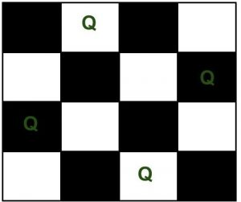

# Backtracking
- [Backtracking](#backtracking)
  - [What is Backtracking?](#what-is-backtracking)
  - [What is Backtracking Algorithm?](#what-is-backtracking-algorithm)
  - [Types of Backtracking Algorithm](#types-of-backtracking-algorithm)
  - [When can be Backtracking Algorithm used?](#when-can-be-backtracking-algorithm-used)
- [1. Introduction to Backtracking](#1-introduction-to-backtracking)
  - [How to determine if a problem can be solved using Backtracking?](#how-to-determine-if-a-problem-can-be-solved-using-backtracking)
    - [Basic terminologies:](#basic-terminologies)
      - [1. Solution vector:](#1-solution-vector)
      - [2. Constraints:](#2-constraints)
        - [1. Implicit constraints:](#1-implicit-constraints)
        - [2. Explicit constraints:](#2-explicit-constraints)
      - [3. Solution space:](#3-solution-space)
      - [4. State space tree:](#4-state-space-tree)
      - [5. State space:](#5-state-space)
      - [6. Problem state:](#6-problem-state)
      - [7. Solution states:](#7-solution-states)
      - [8. Answer states:](#8-answer-states)
      - [9. Promising node:](#9-promising-node)
      - [10. Non-promising node:](#10-non-promising-node)
      - [11. Live node:](#11-live-node)
      - [12. E-node:](#12-e-node)
      - [13. Dead node:](#13-dead-node)
      - [14. Depth first node generation:](#14-depth-first-node-generation)
      - [15. Bounding function:](#15-bounding-function)
      - [16. Static trees:](#16-static-trees)
      - [17. Dynamic trees:](#17-dynamic-trees)
    - [Pseudo Code for Backtracking :](#pseudo-code-for-backtracking-)
    - [Backtracking Algorithm:](#backtracking-algorithm)
      - [Algorithms of Backtracking:](#algorithms-of-backtracking)
- [2. Backtracking vs Branch-N-Bound](#2-backtracking-vs-branch-n-bound)
- [3. Backtracking vs Recursion](#3-backtracking-vs-recursion)
  - [What is Recursion?](#what-is-recursion)
    - [Properties of Recursion:](#properties-of-recursion)
  - [What is Backtracking?](#what-is-backtracking-1)
    - [There are three types of problems in backtracking:](#there-are-three-types-of-problems-in-backtracking)
  - [What is the difference between Backtracking and Recursion?](#what-is-the-difference-between-backtracking-and-recursion)

## What is Backtracking?

Backtracking can be defined as a general algorithmic technique that considers searching every possible combination in order to solve a computational problem.

## What is Backtracking Algorithm?

Backtracking is an algorithmic technique for solving problems recursively by trying to build a solution incrementally, one piece at a time, removing those solutions that fail to satisfy the constraints of the problem at any point of time (by time, here, is referred to the time elapsed till reaching any level of the search tree).

## Types of Backtracking Algorithm

There are three types of problems in backtracking -

1. __Decision Problem__ – In this, we search for a feasible solution.
2. __Optimization Problem__ – In this, we search for the best solution.
3. __Enumeration Problem__ – In this, we find all feasible solutions.

## When can be Backtracking Algorithm used?

For example, consider the SudoKo solving Problem, we try filling digits one by one. Whenever we find that current digit cannot lead to a solution, we remove it (backtrack) and try next digit. This is better than naive approach (generating all possible combinations of digits and then trying every combination one by one) as it drops a set of permutations whenever it backtracks.


# 1. Introduction to Backtracking

__Prerequisites:__

- Recursion
- Complexity Analysis

__Backtracking__ is an algorithmic technique for solving problems recursively by trying to build a solution incrementally, one piece at a time, removing those solutions that fail to satisfy the constraints of the problem at any point in time (by time, here, is referred to the time elapsed till reaching any level of the search tree).

Backtracking can also be said as an improvement to the brute force approach. So basically, the idea behind the backtracking technique is that it searches for a solution to a problem among all the available options.

Initially, we start the backtracking from one possible option and if the problem is solved with that selected option then we return the solution else we backtrack and select another option from the remaining available options. There also might be a case where none of the options will give you the solution and hence we understand that backtracking won’t give any solution to that particular problem.

We can also say that backtracking is a form of recursion. This is because the process of finding the solution from the various option available is repeated recursively until we don’t find the solution or we reach the final state. So we can conclude that backtracking at every step eliminates those choices that cannot give us the solution and proceeds to those choices that have the potential of taking us to the solution.

According to the wiki definition, 

> __Backtracking__ can be defined as a general algorithmic technique that considers searching every possible combination in order to solve a computational problem. 

There are three types of problems in backtracking –  

1. Decision Problem – In this, we search for a feasible solution.
2. Optimization Problem – In this, we search for the best solution.
3. Enumeration Problem – In this, we find all feasible solutions.

## How to determine if a problem can be solved using Backtracking?

Generally, every __`constraint satisfaction problem`__ which has clear and well-defined constraints on any objective solution, that incrementally builds candidate to the solution and abandons a candidate (“backtracks”) as soon as it determines that the candidate cannot possibly be completed to a valid solution, can be solved by Backtracking. However, most of the problems that are discussed, can be solved using other known algorithms like _Dynamic Programming_ or _Greedy Algorithms_ in logarithmic, linear, linear-logarithmic time complexity in order of input size, and therefore, outshine the backtracking algorithm in every respect (since backtracking algorithms are generally exponential in both time and space). However, a few problems still remain, that only have backtracking algorithms to solve them until now. 

Consider a situation that you have three boxes in front of you and only one of them has a gold coin in it but you do not know which one. So, in order to get the coin, you will have to open all of the boxes one by one. You will first check the first box, if it does not contain the coin, you will have to close it and check the second box and so on until you find the coin. This is what backtracking is, that is solving all sub-problems one by one in order to reach the best possible solution.

Consider the below example to understand the Backtracking approach more formally,
Given an instance of any computational problem $ P $ and data $ D $ corresponding to the instance, all the constraints that need to be satisfied in order to solve the problem are represented by $ C $. A backtracking algorithm will then work as follows: 

The Algorithm begins to build up a solution, starting with an empty solution set $ S $. ___S = {}___ 

1. Add to Backtracking | Set 1Backtracking | Set 1the first move that is still left (All possible moves are added to $ S $ one by one). This now creates a new sub-tree $ s $ in the search tree of the algorithm.
2. Check if $ S + s $ satisfies each of the constraints in $ C $.
   - If Yes, then the sub-tree $ s $ is “eligible” to add more “children”.
   - Else, the entire sub-tree $ s $ is useless, so recurs back to step 1 using argument $ S $ .
3. In the event of “eligibility” of the newly formed sub-tree $ s $, recurs back to step 1, using argument $ S+s $ .
4. If the check for $ S+s $ returns that it is a solution for the entire data $ D $. Output and terminate the program. 

If not, then return that no solution is possible with the current $ s $ and hence discard it.

### Basic terminologies:

#### 1. Solution vector:

The desired solution X to a problem instance P of input size n is as a vector of candidate solutions that are selected from some finite set of possible solutions S.

Thus, a solution can be represented as an n-tuple $ (X1, X2, …, Xn) $ and its partial solution is given as $ (X1, X2,…, Xi) $ where $ i<n $.

__E.g:__ for a 4-queens problem $ X = [2,4,1,3] $ is a solution vector.

#### 2. Constraints:

Constraints are the rules to confine the solution vector $ (X1, X2…… Xa) $.

They determine the values of candidate solutions and their relationship with each other. There are two types of constraints:

1. implicit constraints          
2. explicit constraints.

##### 1. Implicit constraints:

These are the rules that identify the tuples in the solution space S that satisfy the specified criterion function of a problem instance P. They give the directives of relating all candidate solutions x’s to each other.

E.g., in the case of the N-queens problem, all xi’s must be distinct satisfying the criterion function of non- attacking queens, in the case of the 0/1 knapsack problem all x’s with value ‘I’ must represent the item giving overall maximum profit and having total weight S knapsack capacity.

##### 2. Explicit constraints:

These are the rules by which all candidate solutions x_{i} ^ prime s are restricted to take on values only from a specified set in a problem instance P. Explicit constraints vary with the instances of the problem.

Eg., in case of the N-queens problem, if $ N = 4 $ then x i in \{1, 2, 3, 4\} and if then x i in [ 1, 2, 3, 4, 5, 6 N = 8 7,8); in case of 0/1 knapsack problem xe \{0, 1\} where x_{i} = 0 represents the exclusion of an item i and x_{i} = 1 represents the inclusion of an item i.

#### 3. Solution space:

All candidate solutions xi’s satisfying the explicit constraints form the solution space S of a problem instance P. In a state space tree, all paths from the root node to a leaf node describe the solution space.

Eg of in the case of N-queens problem, all n! orderings ( x_{1}, x_{2} ,…,x n ) form the solution space of that  problem instance.

#### 4. State space tree:

A representation of the solution space S of a problem instance P in the form of a tree is defined as the state space tree.

It facilitates systematic search in the solution space to determine the desired solution to a problem.

A solution space of a given problem can be represented by different state space trees.

#### 5. State space:

The state space of a problem is described by all paths from a root node to other nodes in a state space tree.

#### 6. Problem state:

Each node in a state space tree describes a problem state or a partial solution formed by making choices from the root of the tree to that node. 

#### 7. Solution states:

These are the problem states producing a tuple in the solution space S. At every internal node, the solution states are partitioned into disjoint sub-solution spaces. In a state space tree for a variable tuple size, all nodes are solution states.

In a state space tree for a fixed tuple size, only the leaf nodes are solution states.

#### 8. Answer states:

These are the solution states that satisfy the implicit constraints.

These states thus describe the desired solution-tuple (or answer-tuple). 

#### 9. Promising node:

A node is promising if it eventually leads to the desired solution.

A promising node corresponds to a partial solution that is still feasible.

Any time the partial node becomes infeasible, that branch will no longer be pursued.

#### 10. Non-promising node:

A node is non-promising if it eventually leads to a state that cannot produce the desired solution. A non-promising node corresponds to a partial solution that shows infeasibility to get a complete solution.

Such nodes are killed by a bounding function without further exploration.

#### 11. Live node:

It is a node that has been generated and all of whose children are not yet been generated.

#### 12. E-node:

It is a live node whose children are currently being generated.

#### 13. Dead node:

A node that is either not to be expanded further or for which all its children have been generated is known as a dead node.

#### 14. Depth first node generation:

Here, the latest live node becomes the next E-node.The moment a new child of the current E-node is generated, that child will be the new E-node. In backtracking, a state space tree is constructed by using the depth first node generation approach.

#### 15. Bounding function:

It is also known as a “validity function”, or “criterion function”, or “promising function”.

It is an optimization function $ B(x1, x2. Xa) $ which is to be either maximized or minimized for a given problem instance P.

It optimizes the search of a solution vector $ (X1, X2,… Xn) $ in the solution space S of a problem instance P. 

It helps to reject the candidate solutions not leading to the desired solution to the problem. Thus, it kills the live nodes without exploring their children if constraints are not satisfied.

Eg, in the case of the knapsack problem, the criterion function is the maximization of the profit by filling a knapsack.

#### 16. Static trees:
These are the state space trees whose tree formulation is independent of the problem instance being solved.

#### 17. Dynamic trees:
These are the state space trees whose tree formulation varies with the problem instance being solved.

__Difference between Recursion and Backtracking:__
In recursion, the function calls itself until it reaches a base case. In backtracking, we use recursion to explore all the possibilities until we get the best result for the problem.

### Pseudo Code for Backtracking :

1. Recursive backtracking solution.

```cpp
void findSolutions(n, other params) :
    if (found a solution) :
        solutionsFound = solutionsFound + 1;
        displaySolution();
        if (solutionsFound >= solutionTarget) : 
            System.exit(0);
        return

    for (val = first to last) :
        if (isValid(val, n)) :
            applyValue(val, n);
            findSolutions(n+1, other params);
            removeValue(val, n);
```

2. Finding whether a solution exists or not 

```cpp
boolean findSolutions(n, other params) :
    if (found a solution) :
        displaySolution();
        return true;

    for (val = first to last) :
        if (isValid(val, n)) :
            applyValue(val, n);
            if (findSolutions(n+1, other params))
                return true;
            removeValue(val, n);
        return false;
```

Let us try to solve a standard Backtracking problem, __N-Queen Problem__. 
The N Queen is the problem of placing N chess queens on an N×N chessboard so that no two queens attack each other. For example, following is a solution for 4 Queen problem. 



The expected output is a binary matrix which has 1s for the blocks where queens are placed. For example, following is the output matrix for the above 4 queen solution. 

```cpp
{ 0,  1,  0,  0}
{ 0,  0,  0,  1}
{ 1,  0,  0,  0}
{ 0,  0,  1,  0}
```

### Backtracking Algorithm:

The idea is to place queens one by one in different columns, starting from the leftmost column. When we place a queen in a column, we check for clashes with already placed queens. In the current column, if we find a row for which there is no clash, we mark this row and column as part of the solution. If we do not find such a row due to clashes then we backtrack and return false. 

#### Algorithms of Backtracking:

1. Generate k-ary Strings
2. Graph Coloring Problem
3. Hamiltonian Cycles
4. N-Queens Problem
5. Knapsack Problem

```cpp
1) Start in the leftmost column
2) If all queens are placed
    return true
3) Try all rows in the current column.  Do following for every tried row.
    a) If the queen can be placed safely in this row then mark this [row, 
        column] as part of the solution and recursively check if placing  
        queen here leads to a solution.
    b) If placing the queen in [row, column] leads to a solution then return 
        true.
    c) If placing queen doesn't lead to a solution then unmark this [row, 
        column] (Backtrack) and go to step (a) to try other rows.
4) If all rows have been tried and nothing worked, return false to trigger 
    backtracking.
```

# 2. Backtracking vs Branch-N-Bound

_Algorithms_ are the methodical sequence of steps which are defined to solve complex problems. In this article, we will see the difference between two such algorithms which are backtracking and branch and bound technique.

Before getting into the differences, lets first understand each of these algorithms. 

__Backtracking:__
_Backtracking_ is a general algorithm for finding all the solutions to some computational problems, notably constraint satisfaction problems, that incrementally builds possible candidates to the solutions and abandons a candidate as soon as it determines that the candidate cannot possibly be completed to finally become a valid solution. It is an algorithmic-technique for solving problems _recursively_ by trying to build a solution incrementally, one piece at a time, removing those solutions that fail to satisfy the constraints of the problem at any point of time (by time, here, is referred to the time elapsed till reaching any level of the search tree).

__Branch and Bound:__
_Branch and bound_ is an algorithm design paradigm for discrete and combinatoric optimisation problems, as well as mathematical optimisation. A branch-and-bound algorithm consists of a systematic enumeration of candidate solutions. That is, the set of candidate solutions is thought of as forming a rooted tree with the full set at the root. The algorithm explores branches of this tree, which represent the subsets of the solution set. Before enumerating the candidate solutions of a branch, the branch is checked against upper and lower estimated bounds on the optimal solution and is discarded if it cannot produce a better solution than the best one found so far by the algorithm.

__Branch and bound algorithmic strategy for solving the problem__

Branch and bound builds the state space tree and find the optimal solution quickly by pruning few of the tree branches which does not satisfy the bound.

Backtracking can be useful where some other optimization techniques like greedy or dynamic programming fail. Such algorithms are typically slower than their counterparts. In the worst case, it may run in exponential time, but careful selection of bounds and branches makes an algorithm to run reasonably faster. Most of the terminologies of backtracking are used in this chapter too. In branch and bound, all the children of E nodes are generated before any other live node becomes E node.

Branch and bound technique in which E-node puts its children in the queue is called FIFO branch and bound approach.

And if E-node puts its children in the stack, then it is called LIFO branch and bound approach.

Bounding functions are a heuristic function. Heuristic function computes the node which maximizes the probability of better search minimizes the probability of worst search. According to maximization or minimization problem, highest or lowest heuristic valued node is selected for further expansion from a set of nodes.

The following table explains the difference between both the algorithms:

|Parameter|Backtracking|Branch and Bound|
|---|---|---|
|Approach|Backtracking is used to find all possible solutions available to a problem. When it realises that it has made a bad choice, it undoes the last choice by backing it up. It searches the state space tree until it has found a solution for the problem. |Branch-and-Bound is used to solve optimisation problems. When it realises that it already has a better optimal solution that the pre-solution leads to, it abandons that pre-solution. It completely searches the state space tree to get optimal solution.|
|Traversal|Backtracking traverses the state space tree by __DFS(Depth First Search)__ manner.|Branch-and-Bound traverse the tree in any manner, __DFS__ or __BFS__.|
|Function|Backtracking involves feasibility function.|Branch-and-Bound involves a bounding function.|
|Problems|Backtracking is used for solving Decision Problem.|Branch-and-Bound is used for solving Optimisation Problem.|
|Searching|In backtracking, the state space tree is searched until the solution is obtained.|In Branch-and-Bound as the optimum solution may be present any where in the state space tree, so the tree need to be searched completely.|
|Efficiency|Backtracking is more efficient.|Branch-and-Bound is less efficient.|
|Applications|Useful in solving __N-Queen__ Problem, __Sum of subset__, __Hamilton cycle__ problem, __graph coloring__ problem |Useful in solving __Knapsack__ Problem, __Travelling Salesman__ Problem.|
|Solve|Backtracking can solve almost any problem. (chess, sudoku, etc ).|Branch-and-Bound can not solve almost any problem.|
|Used for |Typically backtracking is used to solve decision problems.|Branch and bound is used to solve optimization problems.|
|Nodes |Nodes in stat  space tree are explored in depth first tree.|Nodes in tree may be explored in depth-first or breadth-first order.|
|Next move |Next move from current state can lead to bad choice.|Next move is always towards better solution.|
|Solution |	On successful search of  solution in state space tree, search stops.|Entire state space tree is search in order to find optimal solution.|

# 3. Backtracking vs Recursion

## What is Recursion?

> The process in which a function calls itself directly or indirectly is called recursion and the corresponding function is called a recursive function.

### Properties of Recursion:

- Performing the same operations multiple times with different inputs.
- In every step, we try smaller inputs to make the problem smaller.
- A base condition is needed to stop the recursion otherwise infinite loop will occur.

## What is Backtracking?

> Backtracking is an algorithmic technique for solving problems recursively by trying to build a solution incrementally, one piece at a time, removing those solutions that fail to satisfy the constraints of the problem at any point in time (by time, here, is referred to the time elapsed till reaching any level of the search tree).

Backtracking can be defined as a general algorithmic technique that considers searching every possible combination in order to solve a computational problem.

### There are three types of problems in backtracking:

1. Decision Problem – In this, we search for a feasible solution.
2. Optimization Problem – In this, we search for the best solution.
3. Enumeration Problem – In this, we find all feasible solutions.

## What is the difference between Backtracking and Recursion?

|S.NO.|Recursion|Backtracking|
|---|---|---|
|1.|Recursion does not always need backtracking|Backtracking always uses recursion to solve problems|
|2.|A recursive function solves a particular problem by calling a copy of itself and solving smaller subproblems of the original problems.|Backtracking at every step eliminates those choices that cannot give us the solution and proceeds to those choices that have the potential of taking us to the solution.|
|3.|Recursion is a part of backtracking itself and it is simpler to write.|Backtracking is comparatively complex to implement.|
|4.|Applications of recursion are Tree and Graph Traversal, Towers of Hanoi, Divide and Conquer Algorithms, Merge Sort, Quick Sort, and Binary Search.|Application of Backtracking is N Queen problem, Rat in a Maze problem, Knight’s Tour Problem, Sudoku solver, and Graph coloring problems.|
