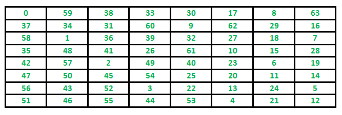

# Standard Problems

- [Standard Problems](#standard-problems)
  - [1. The Knight’s tour problem](#1-the-knights-tour-problem)
    - [1. Naive Algorithm for Knight’s tour](#1-naive-algorithm-for-knights-tour)


## 1. The Knight’s tour problem

Backtracking is an algorithmic paradigm that tries different solutions until finds a solution that “works”. Problems that are typically solved using the backtracking technique have the following property in common. These problems can only be solved by trying every possible configuration and each configuration is tried only once. A Naive solution for these problems is to try all configurations and output a configuration that follows given problem constraints. Backtracking works incrementally and is an optimization over the Naive solution where all possible configurations are generated and tried.

For example, consider the following __`Knight’s Tour problem`__.

__Problem Statement:__
Given a N*N board with the Knight placed on the first block of an empty board. Moving according to the rules of chess knight must visit each square exactly once. Print the order of each cell in which they are visited.

__Example:__

```yml
Input : 
N = 8
Output:
0  59  38  33  30  17   8  63
37  34  31  60   9  62  29  16
58   1  36  39  32  27  18   7
35  48  41  26  61  10  15  28
42  57   2  49  40  23   6  19
47  50  45  54  25  20  11  14
56  43  52   3  22  13  24   5
51  46  55  44  53   4  21  12
```

__The path followed by Knight to cover all the cells__
Following is a chessboard with 8 x 8 cells. Numbers in cells indicate the move number of Knight.



Let us first discuss the Naive algorithm for this problem and then the Backtracking algorithm.

### 1. Naive Algorithm for Knight’s tour 

The Naive Algorithm is to generate all tours one by one and check if the generated tour satisfies the constraints. 

