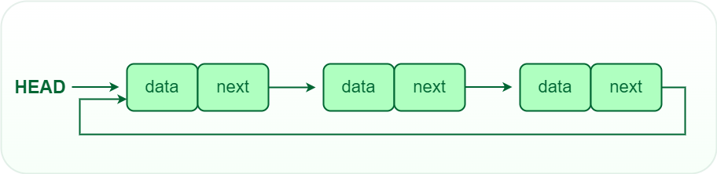

# Introduction

- [Introduction](#introduction)
  - [What is Linked List](#what-is-linked-list)
    - [Why Linked List?](#why-linked-list)
    - [Advantages of Linked Lists over arrays:](#advantages-of-linked-lists-over-arrays)
    - [Drawbacks of Linked Lists:](#drawbacks-of-linked-lists)
    - [Types of Linked Lists:](#types-of-linked-lists)
    - [Basic operations on Linked Lists:](#basic-operations-on-linked-lists)
    - [Representation of Singly Linked Lists:](#representation-of-singly-linked-lists)
    - [Implementation](#implementation)
    - [Construction of a simple linked list with 3 nodes:](#construction-of-a-simple-linked-list-with-3-nodes)
      - [Traversal of a Linked List](#traversal-of-a-linked-list)
      - [Practice](#practice)
- [Introduction to Linked List](#introduction-to-linked-list)
  - [What is a Linked List?](#what-is-a-linked-list)
  - [Why linked list data structure needed?](#why-linked-list-data-structure-needed)
  - [Types of linked lists:](#types-of-linked-lists-1)
    - [1. Singly-linked list](#1-singly-linked-list)
      - [Representation of Single linked list:](#representation-of-single-linked-list)
      - [Practice problems on Singly linked list:](#practice-problems-on-singly-linked-list)
    - [2. Doubly linked list](#2-doubly-linked-list)
      - [Representation of Doubly linked list:](#representation-of-doubly-linked-list)
      - [Commonly used operations on Double-Linked List:](#commonly-used-operations-on-double-linked-list)
      - [Practice problems on Doubly linked list:](#practice-problems-on-doubly-linked-list)
    - [3. Circular linked lists](#3-circular-linked-lists)
      - [Commonly used operations on Circular Linked List:](#commonly-used-operations-on-circular-linked-list)
      - [Practice problems on Circular linked list:](#practice-problems-on-circular-linked-list)
  - [Linked List vs. Array](#linked-list-vs-array)
    - [Linked List vs. Array in Time Complexity](#linked-list-vs-array-in-time-complexity)
  - [Advantages of Linked Lists:](#advantages-of-linked-lists)
  - [Disadvantages of Linked Lists:](#disadvantages-of-linked-lists)
  - [Applications of Linked List:](#applications-of-linked-list)
  - [Applications of Linked Lists in real world:](#applications-of-linked-lists-in-real-world)
  - [Most Commonly asked interview questions on the linked list:](#most-commonly-asked-interview-questions-on-the-linked-list)
    - [Frequently asked questions (FAQs) about Linked list:](#frequently-asked-questions-faqs-about-linked-list)
      - [1. What is linked list data structure?](#1-what-is-linked-list-data-structure)
      - [2. What is linked list example?](#2-what-is-linked-list-example)
      - [3. Why do we need linked list data structure??](#3-why-do-we-need-linked-list-data-structure)
      - [4. What are linked lists used for?](#4-what-are-linked-lists-used-for)
      - [5. What is the difference between array and linked list?](#5-what-is-the-difference-between-array-and-linked-list)
      - [6. Why is a linked list preferred over an array?](#6-why-is-a-linked-list-preferred-over-an-array)
      - [7. What is the difference between a singly and doubly linked list?](#7-what-is-the-difference-between-a-singly-and-doubly-linked-list)


## What is Linked List

Like arrays, a Linked List is a linear data structure. Unlike arrays, linked list elements are not stored at a contiguous location; the elements are linked using pointers.
They include a series of connected nodes. Here, each node stores the data and the address of the next node.


### Why Linked List?

Arrays can be used to store linear data of similar types, but arrays have the following limitations:

1. __The size of the arrays is fixed:__ So we must know the upper limit on the number of elements in advance. Also, generally, the allocated memory is equal to the upper limit irrespective of the usage.
2. __Insertion of a new element / Deletion of a existing element in an array of elements is expensive:__ The room has to be created for the new elements and to create room existing elements have to be shifted but in Linked list if we have the head node then we can traverse to any node through it and insert new node at the required position.

__Example:__
In a system, if we maintain a sorted list of IDs in an array id[] = [1000, 1010, 1050, 2000, 2040].
If we want to insert a new ID 1005, then to maintain the sorted order, we have to move all the elements after 1000 (excluding 1000).
Deletion is also expensive with arrays until unless some special techniques are used. For example, to delete 1010 in id[], everything after 1010 has to be moved due to this so much work is being done which affects the efficiency of the code.

### Advantages of Linked Lists over arrays:

1. Dynamic Array.
2. Ease of Insertion/Deletion.

### Drawbacks of Linked Lists:

1. Random access is not allowed. We have to access elements sequentially starting from the first node(head node). So we cannot do a binary search with linked lists efficiently with its default implementation.
2. Extra memory space for a pointer is required with each element of the list.
3. Not cache-friendly. Since array elements are contiguous locations, there is the locality of reference which is not there in the case of linked lists.
4. It takes a lot of time in traversing and changing the pointers.
5. Reverse traversing is not possible in singly linked lists.
6. It will be confusing when we work with pointers.
7. Direct access to an element is not possible in a linked list as in an array by index.
8. Searching for an element is costly and requires O(n) time complexity.
9. Sorting of linked lists is very complex and costly.

### Types of Linked Lists:

1. __Simple Linked List__ – In this type of linked list, one can move or traverse the linked list in only one direction. where the next pointer of each node points to other nodes but the next pointer of the last node points to NULL. It is also called “Singly Linked List”.
2. __Doubly Linked List__ – In this type of linked list, one can move or traverse the linked list in both directions (Forward and Backward)
3. __Circular Linked List__ – In this type of linked list, the last node of the linked list contains the link of the first/head node of the linked list in its next pointer.
4. __Doubly Circular Linked List__ – A Doubly Circular linked list or a circular two-way linked list is a more complex type of linked list that contains a pointer to the next as well as the previous node in the sequence. The difference between the doubly linked and circular doubly list is the same as that between a singly linked list and a circular linked list. The circular doubly linked list does not contain null in the previous field of the first node.
5. __Header Linked List__ – A header linked list is a special type of linked list that contains a header node at the beginning of the list. 

### Basic operations on Linked Lists:

1. Deletion
2. Insertion
3. Search
4. Display

### Representation of Singly Linked Lists:

A linked list is represented by a pointer to the first node of the linked list. The first node is called the head of the linked list. If the linked list is empty, then the value of the head points to NULL.

Each node in a list consists of at least two parts:

1. A Data Item (we can store integers, strings, or any type of data).
2. Pointer (Or Reference) to the next node (connects one node to another) or An address of another node.

- In C, we can represent a node using structures. Below is an example of a linked list node with integer data.
- In Java or C#, LinkedList can be represented as a class and a Node as a separate class. The LinkedList class contains a reference of Node class type. 

### Implementation

```py

```

### Construction of a simple linked list with 3 nodes:

#### Traversal of a Linked List

In the previous program, we created a simple linked list with three nodes. Let us traverse the created list and print the data of each node. For traversal, let us write a general-purpose function printList() that prints any given list.

#### Practice

|Question Name|Platform 1|Platform 2|
|---|---|---|
|Print Linked List Elements|[GFG](https://practice.geeksforgeeks.org/problems/print-linked-list-elements/1)||

```py

```

```yml
Output: 1  2  3 
```

__Time Complexity:__

|Time Complexity|Worst Case|Average Case|
|---|---|---|
|Search|O(n)|O(n)|
|Insertion|O(1)|O(1)|
|Deletion|O(1)|O(1)|

- Search is O(n) because as data is not stored in contiguous memory locations so we have to traverse one by one.
- Insertion and Deletion are O(1) because we have to just link new nodes for Insertion with the previous and next node and dislink exist nodes for deletion from the previous and next nodes without any traversal.

__Auxiliary Space:__ O(N) [To store dynamic memory]

# Introduction to Linked List

## What is a Linked List?

> A Linked List is a linear data structure which looks like a chain of nodes, where each node is a different element. Unlike Arrays, Linked List elements are not stored at a contiguous location.

It is basically __chains of nodes__, each node contains information such as __data__ and a __pointer to the next node__ in the chain. In the linked list there is a __head pointer__, which points to the first element of the linked list, and if the list is empty then it simply points to null or nothing.

## Why linked list data structure needed?

Here are a few advantages of a linked list that is listed below, it will help you understand why it is necessary to know.

- __Dynamic Data structure:__ The size of memory can be allocated or de-allocated at run time based on the operation insertion or deletion.
- __Ease of Insertion/Deletion:__ The insertion and deletion of elements are simpler than arrays since no elements need to be shifted after insertion and deletion, Just the address needed to be updated.
- __Efficient Memory Utilization:__ As we know Linked List is a dynamic data structure the size increases or decreases as per the requirement so this avoids the wastage of memory. 
- __Implementation:__ Various advanced data structures can be implemented using a linked list like a stack, queue, graph, hash maps, etc.

## Types of linked lists:

There are mainly three types of linked lists:

1. Single linked list
2. Double linked list
3. Circular linked list

### 1. Singly-linked list

Traversal of items can be done in the forward direction only due to the linking of every node to its next node.


#### Representation of Single linked list:

__A Node Creation:__

```py

```

__Commonly used operations on Singly Linked List:__

The following operations are performed on a Single Linked List

1. __Insertion:__ The insertion operation can be performed in three ways. They are as follows…

- Inserting At the Beginning of the list
- Inserting At End of the list
- Inserting At Specific location in the list

2. __Deletion:__ The deletion operation can be performed in three ways. They are as follows…

- Deleting from the Beginning of the list
- Deleting from the End of the list
- Deleting a Specific Node

3. __Search:__ It is a process of determining and retrieving a specific node either from the front, the end or anywhere in the list.
4. __Display:__ This process displays the elements of a Single-linked list.

#### Practice problems on Singly linked list:

|S.no|Question|Article|
|---|---|---|
|1.|Introduction to Linked List|[View]()|
|2.|Detect loop in a linked list|[View]()|
|3.|Find length of loop in linked list|[View]()|
|4.|Function to check if a singly linked list is palindrome|[View]()|
|5.|Remove duplicates from a sorted linked list|[View]()|
|6.|Remove duplicates from an unsorted linked list|[View]()|
|7.|Remove loop in Linked List|[View]()|
|8.|Swap nodes in a linked list without swapping data|[View]()|
|9.|Move last element to front of a given Linked List|[View]()|
|10.|Intersection of two Sorted Linked Lists|[View]()|

### 2. Doubly linked list

Traversal of items can be done in both forward and backward directions as every node contains an additional prev pointer that points to the previous node.


#### Representation of Doubly linked list:

- A Node Creation:

```py

```

#### Commonly used operations on Double-Linked List:

In a double-linked list, we perform the following operations…

1. __Insertion:__ The insertion operation can be performed in three ways as follows:
  - Inserting At the Beginning of the list
  - Inserting after a given node.
  - Inserting at the end.
  - Inserting before a given node

2. __Deletion:__ The deletion operation can be performed in three ways as follows…
  - Deleting from the Beginning of the list
  - Deleting from the End of the list
  - Deleting a Specific Node

3. __Display:__ This process displays the elements of a double-linked list.

#### Practice problems on Doubly linked list:

|S.no|Question|Article|
|---|---|----|
|1.|Reverse a Doubly Linked List|View|
|2.|Copy a linked list with next and arbit pointer|View|
|3.|Swap Kth node from beginning with Kth node from end in a Linked List|View|
|4.|Merge Sort for Doubly Linked List|View|
|5.|Sort a k sorted doubly linked list|View|
|6.|Remove duplicates from an unsorted linked list|View|
|7.|Rotate Doubly linked list by N nodes|View|
|8.|Merge Two Balanced Binary Search Trees|View|
|9.|Convert a Binary Tree into Doubly Linked List in spiral fashion|View|
|10.|Convert a given Binary Tree to Doubly Linked List|View|

### 3. Circular linked lists

A circular linked list is a type of linked list in which the first and the last nodes are also connected to each other to form a circle, there is no NULL at the end. 



#### Commonly used operations on Circular Linked List:

The following operations are performed on a Circular Linked List

1. __Insertion:__ The insertion operation can be performed in three ways:
- Insertion in an empty list
- Insertion at the beginning of the list 
- Insertion at the end of the list 
- Insertion in between the nodes 
2. __Deletion:__ The deletion operation can be performed in three ways:
- Deleting from the Beginning of the list
- Deleting from the End of the list
- Deleting a Specific Node
3. __Display:__ This process displays the elements of a Circular linked list.

#### Practice problems on Circular linked list:

|S.no|Question|Article|
|---|---|---|
|1.|Circular Linked List Traversal|View|
|2.|Split a Circular Linked List into two halves|View|
|3.|Sorted insert for circular linked list|View|
|4.|Check if a linked list is Circular Linked List|View|
|5.|Deletion from a Circular Linked List|View|
|6.|Josephus Circle using circular linked list|View|
|7.|Convert singly linked list into circular linked list|View|
|8.|Implementation of Deque using circular array|View|
|9.|Exchange first and last nodes in Circular Linked List|View|
|10.|Count nodes in Circular linked list|View|

## Linked List vs. Array


### Linked List vs. Array in Time Complexity

|Operation|Linked list|Array|
|---|---|---|
|Random Access|O(N)|O(1)|
|Insertion and deletion at beginning|O(1)|(N)|
|Insertion and deletion at end|O(N)|O(1)|
|Insertion and deletion at a random position|O(N)|O(N)|

## Advantages of Linked Lists:

- __Dynamic nature:__ Linked lists are used for dynamic memory allocation.
- __Memory efficient:__ Memory consumption of a linked list is efficient as its size can grow or shrink dynamically according to our requirements, which means effective memory utilization hence, no memory wastage.
- __Ease of Insertion and Deletion:__ Insertion and deletion of nodes are easily implemented in a linked list at any position.
- __Implementation:__ For the implementation of stacks and queues and for the representation of trees and graphs.
- The linked list can be expanded in constant time.

## Disadvantages of Linked Lists:

- __Memory usage:__ The use of pointers is more in linked lists hence, complex and requires more memory.
- __Accessing a node:__ Random access is not possible due to dynamic memory allocation.
- __Search operation costly:__ Searching for an element is costly and requires O(n) time complexity.
- __Traversing in reverse order:__ Traversing is more time-consuming and reverse traversing is not possible in singly linked lists. 

## Applications of Linked List: 

Here are some of the applications of a linked list:

- Linear data structures such as stack, queue, and non-linear data structures such as hash maps, and graphs can be implemented using linked lists.
- __Dynamic memory allocation:__ We use a linked list of free blocks.
- __Implementation of graphs__: Adjacency list representation of graphs is the most popular in that it uses linked lists to store adjacent vertices.
- In web browsers and editors, doubly linked lists can be used to build a forwards and backward navigation button.
- A circular doubly linked list can also be used for implementing data structures like Fibonacci heaps.

## Applications of Linked Lists in real world:

- The list of songs in the music player is linked to the previous and next songs. 
- In a web browser, previous and next web page URLs are linked through the previous and next buttons.
- In the image viewer, the previous and next images are linked with the help of the previous and next buttons.
- Switching between two applications is carried out by using “__alt+tab__” in windows and “__cmd+tab__” in mac book. It requires the functionality of a circular linked list.
- In mobile phones, we save the contacts of people. The newly entered contact details will be placed at the correct alphabetical order.
- This can be achieved by a linked list to set contact at the correct alphabetical position.
- The modifications that we made in the documents are actually created as nodes in doubly linked list. We can simply use the undo option by pressing __Ctrl+Z__ to modify the contents. It is done by the functionality of a linked list.

## Most Commonly asked interview questions on the linked list:

|S.no|Question|Article|Practice|
|1.|Finding the middle element in a Linked list|View|Solve|
|2.|Reverse a Linked list|View|Solve|
|3.|Rotate a Linked List|View|Solve|
|4.|Reverse a Linked List in groups of given size|View|Solve|
|5.|Intersection point in Y shaped Linked lists|View|Solve|
|6.|Detect Loop in Linked list|View|Solve|
|7.|Remove loop in Linked List|View|Solve|
|8.|n’th node from end of Linked list|View|Solve|
|9.|Flattening a Linked List|View|Solve|
|10.|Merge two sorted Linked lists|View|Solve|
|11.|Pairwise swap of a Linked list|View|Solve|
|12.|Add two numbers represented by Linked lists|View|Solve|
|13.|Check if Linked List is Palindrome|View|Solve|
|14.|Implement Queue using Linked List|View|Solve|
|15.|Implement Stack using Linked List|View|Solve|
|16.|Given a Linked list of 0s, 1s and 2s, sort it|View|Solve|
|17.|Delete without head pointer|View|Solve|

### Frequently asked questions (FAQs) about Linked list:

#### 1. What is linked list data structure?

Linked list are most commonly used to handle dynamic data elements. Linked list consists of nodes and a node consists of two fields one for storing data and other for keeping the reference of next node.

#### 2. What is linked list example?

A linked list can be assumed as a garland that is made up of flowers. Similarly, a linked list is made up of nodes. Every flower in this particular garland is referred to as a node. In addition, each node points to the next node in this list, and it contains data (in this case, the type of flower).

#### 3. Why do we need linked list data structure??

There are some important advantages to using linked lists over other linear data structures. This is unlike arrays, as they are resizable at runtime. Additionally, they can be easily inserted and deleted.

#### 4. What are linked lists used for?

The linked list is a linear data structure that stores data in nodes. these nodes hold both the data and a reference to the next node in the list. Linked are very efficient at adding and removing nodes because of their simple structure.
#### 5. What is the difference between array and linked list?

There are some following differences between them:

- Arrays are data structures containing similar data elements, whereas linked lists are non-primitive data structures containing unordered linked elements.
- In an array, elements are indexed, but in a linked list nodes are not indexed.
- Accessing an element array is fast if we know the position of an element in the array, while in the Linked list it takes linear time so, the Linked list is quite bit slower.
- Operations like insertion and deletion in arrays take a lot of time. Whereas, the performance of these operations is faster in Linked lists.
- Arrays are of fixed size and their size is static but Linked lists are dynamic and flexible and can expand and shrink their size. 

#### 6. Why is a linked list preferred over an array?

Following are the reason that linked lists are preferred over array

- Nodes in a linked array, insertions, and deletions can be done at any point in the list at a constant time.
- Arrays are of fixed size and their size is static but Linked lists are dynamic and flexible and can expand and shrink their size.
- Linked lists provide an efficient way of storing related data and performing basic operations such as insertion, deletion, and updating of information at the cost of extra space required for storing the address.
- Insertion and deletion operations in the linked list are faster as compared to the array. 

#### 7. What is the difference between a singly and doubly linked list?

Following are some difference between single and double linked list.

Singly-linked list (SLL)	Doubly linked list (DLL)
SLL nodes contains 2 field data field and next link field.	DLL nodes contains 3 fields data field, a previous link field and a next link field.
In SLL, the traversal can be done using the next node link only. Thus traversal is possible in one direction only.	In DLL, the traversal can be done using the previous node link or the next node link. Thus traversal is possible in both directions (forward and backward).
The SLL occupies less memory than DLL as it has only 2 fields.	The DLL occupies more memory than SLL as it has 3 fields.
The Complexity of insertion and deletion at a given position is O(n). 	The Complexity of insertion and deletion at a given position is O(n / 2) = O(n) because traversal can be made from start or from the end.
Complexity of deletion with a given node is O(n), because the previous node needs to be known, and traversal takes O(n)	Complexity of deletion with a given node is O(1) because the previous node can be accessed easily 
A singly linked list consumes less memory as compared to the doubly linked list.	The doubly linked list consumes more memory as compared to the singly linked list.

8. Which is the best array or linked list?

There are some advantages and disadvantages to both arrays and linked lists when it comes to storing linear data of similar types.
Advantages of linked list over arrays:

    Dynamic size:  Linked lists are dynamic and flexible and can expand and shrink their size
    Ease of Insertion/Deletion: Insertion and deletion operations in linked list are faster as compared to the array

Disadvantages of linked list over arrays:

    If the array is sorted we can apply binary search to search any element which takes O(log(n)) time. But even if the linked list is sorted we cannot apply binary search and the complexity of searching elements in the linked list is O(n).
    A linked list takes more memory as compared to the array because extra memory space is required for the pointer with each element in the linked list.
     

9. What are the limitations of linked list?

Following are some limitations of the linked list:

    The use of pointers is more in linked lists hence, complex and requires more memory.
    Random access is not possible due to dynamic memory allocation.
    Traversing is more time-consuming and reverse traversing is not possible in singly linked lists.
    Searching for an element is costly and requires O(n) time complexity.
     

10. Why insertion/deletion are faster in a linked list?

If any element is inserted/ deleted from the array, all the other elements after it will be shifted in memory this takes a lot of time whereas manipulation in Linked List is faster because we just need to manipulate the addresses of nodes, so no bit shifting is required in memory, and it will not take that much of time.
Conclusion

There are many advantages of the linked list compared to array, despite the fact that they solve the similar problem to arrays, we have also discussed the advantage, disadvantages, and its application, and we concluded the fact that we can use a linked list if we need the dynamic size of storage and list are good for adding and removing items quickly or for tasks that require sequence but are not suitable for querying or search elements in a large collection of data.

So, it becomes important that we should always keep in mind the positive and negative aspects of a data structure and how they relate to the problem you are trying to solve.

