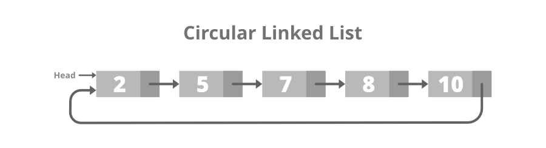

# 1. Types of Linked List

A __linked list__ is a linear data structure, in which the elements are not stored at contiguous memory locations. The elements in a linked list are linked using __pointers__. In simple words, a linked list consists of nodes where each node contains a data field and a reference(link) to the next node in the list. 

- [1. Types of Linked List](#1-types-of-linked-list)
  - [Types Of Linked List:](#types-of-linked-list)
    - [1. Singly Linked List](#1-singly-linked-list)
      - [Structure of the singly linked list:](#structure-of-the-singly-linked-list)
      - [Creation and Traversal of Singly Linked List:](#creation-and-traversal-of-singly-linked-list)
    - [2. Doubly Linked List](#2-doubly-linked-list)
      - [Structure of Doubly Linked List:](#structure-of-doubly-linked-list)
      - [Creation and Traversal of Doubly Linked List:](#creation-and-traversal-of-doubly-linked-list)
    - [3. Circular Linked List](#3-circular-linked-list)
      - [structure of the Circular Linked List:](#structure-of-the-circular-linked-list)
      - [Creation and Traversal of Circular Linked List:](#creation-and-traversal-of-circular-linked-list)
    - [4. Doubly Circular linked list](#4-doubly-circular-linked-list)
      - [Structure of the Doubly Circular Linked List:](#structure-of-the-doubly-circular-linked-list)
      - [Creation and Traversal of Doubly Circular Linked List:](#creation-and-traversal-of-doubly-circular-linked-list)
    - [5. Header Linked List:](#5-header-linked-list)
      - [Structure of the Grounded Header Linked List:](#structure-of-the-grounded-header-linked-list)
      - [Creation and Traversal of Header Linked List:](#creation-and-traversal-of-header-linked-list)
  - [Additional Types:](#additional-types)


## Types Of Linked List:

### 1. Singly Linked List

> It is the simplest type of linked list in which every node contains some data and a pointer to the next node of the same data type. 

The node contains a pointer to the next node means that the node stores the address of the next node in the sequence. A single linked list allows the traversal of data only in one way. Below is the image for the same:


#### Structure of the singly linked list:

```py
# Node of a Singly Linked List

class Node:
    def __init__(self,data = None) -> None:
        self.data = data
        self.next = None
```

#### Creation and Traversal of Singly Linked List:

```py
# Traversal of SLL

class Node:
    def __init__(self, data) -> None:
        self.data = data
        self.next = None

class LinkedList():
    def __init__(self) -> None:
        self.head = None
        self.last_node = None
    
    def append(self, data):
        # if linked list is empty then last_node will be none so in if condition head will be created
        if self.last_node is None:
            self.head = Node(data)
            self.last_node = self.head
        else:
            # adding node to the tail of linked list
            self.last_node.next = Node(data)
            self.last_node = self.last_node.next
    
    def display(self):
        current = self.head
        
        while current is not None:
            print(current.data, end=', ')
            current = current.next
        print()

if __name__ == '__main__':
    L = LinkedList()
    
    L.append(1)
    L.append(2)
    L.append(3)
    L.append(4)
    L.append(5)
    L.display()
```

```yml
Output: 1, 2, 3, 4, 5, 
```

__Time Complexity:__ O(N)

__Auxiliary Space:__ O(N)

### 2. Doubly Linked List

> A doubly linked list or a two-way linked list is a more complex type of linked list that contains a pointer to the next as well as the previous node in sequence. 

Therefore, it contains three parts of data, a pointer to the next node, and a pointer to the previous node. This would enable us to traverse the list in the backward direction as well. Below is the image for the same:


#### Structure of Doubly Linked List:

```py
# Structure of DLL

class Node:
    def __init__(self, data) -> None:
        self.data = data
        self.next = None
        self.previous = None
```

#### Creation and Traversal of Doubly Linked List:

```py
# Traversal of DLL

class Node:
    def __init__(self, data) -> None:
        self.data = data
        self.next = None
        self.previous = None

class DoublyLinkedList:
    def __init__(self) -> None:
        self.head = None
        self.start_node = None
        self.last_node = None
    
    def append(self, data):
        if self.last_node is None:
            self.head = Node(data)
            self.last_node = self.head
        else:
            new_node = Node(data)
            self.last_node.next = new_node
            new_node.previous = self.last_node
            new_node.next = None
            self.last_node = new_node
    
    def display(self,Type):
        if Type == 'Left_To_Right':
            current = self.head
            print(Type,':')
            while current is not None:
                print(current.data, end=' ')
                current = current.next
            print()
        else:
            current = self.last_node
            print(Type,':')
            while current is not None:
                print(current.data, end = ' ')
                current = current.previous
            print()

if __name__ == "__main__":
    L = DoublyLinkedList()
    L.append(10)
    L.append(20)
    L.append(30)
    L.append(40)
    L.append(50)
    
    L.display('Left_To_Right')
    L.display('Right_To_Left')
```

```yml
Output:

Left_To_Right :
10 20 30 40 50 
Right_To_Left :
50 40 30 20 10 
```

### 3. Circular Linked List

> A circular linked list is that in which the last node contains the pointer to the first node of the list. 

While traversing a circular linked list, we can begin at any node and traverse the list in any direction forward and backward until we reach the same node we started. Thus, a circular linked list has no beginning and no end. Below is the image for the same:



#### structure of the Circular Linked List:

```py
class Node:
    def __init__(self, data) -> None:
        self.data = data
        self.next = None
```

#### Creation and Traversal of Circular Linked List:

```py
# Traversal CLL

class Node:
    def __init__(self, data) -> None:
        self.data = data
        self.next = None

class CircularLinkedList:
    def __init__(self) -> None:
        self.head = None
        self.last_node = None
    
    def append(self, data):
        # is circular linked list is empty then last_node will be none so in if condition head will be created
        if self.last_node is None:
            self.head = Node(data)
            self.last_node =self.head
        # adding node to the tail of circular linked list
        else:
            self.last_node.next = Node(data)
            self.last_node = self.last_node.next
            self.last_node.next = self.head
    
    def display(self):
        current = self.head
        while current is not None:
            print(current.data, end=' ')
            current = current.next
            if current == self.head:
                break
        print()

if __name__ == '__main__':
    L = CircularLinkedList()
    L.append(12)
    L.append(54)
    L.append(3)
    L.append(77)
    
    L.display()
```

```yml
Output: 12 54 3 77 
```

### 4. Doubly Circular linked list

A Doubly Circular linked list or a circular two-way linked list is a more complex type of linked list that contains a pointer to the next as well as the previous node in the sequence. The difference between the doubly linked and circular doubly list is the same as that between a singly linked list and a circular linked list. The circular doubly linked list does not contain null in the previous field of the first node. Below is the image for the same:


#### Structure of the Doubly Circular Linked List:

```py
# Node Creation DCLL

class Node:
    def __init__(self, data) -> None:
        self.previous = None
        self.data = data
        self.next = None
```

#### Creation and Traversal of Doubly Circular Linked List:

```py
# Creation and Traversal of DCLL

class Node:
    def __init__(self, data) -> None:
        self.previous = None
        self.data = data
        self.next = None

class DoublyCircularLinkedList:
    def __init__(self) -> None:
        self.head = None
        self.start_node = None
        self.last_node = None
    
    def append(self, data):
        # is doubly linked list is empty then last_node will be none so in if condition head will be created
        if self.last_node is None:
            self.head =Node(data)
            self.last_node =self.head
        # adding node to the tail of doubly linked list
        else:
            new_node = Node(data)
            self.last_node.next =new_node
            new_node.previous =self.last_node
            new_node.next =self.head
            self.head.previous =new_node
            self.last_node = new_node
    
    def display(self, Type = 'Left To Right'):
        if Type == 'Left To Right':
            current = self.head
            while current.next is not None:
                print(current.data, end=' ')
                current = current.next
                if current == self.head:
                    break
            print()
        else:
            current = self.last_node
            while current.previous is not None:
                print(current.data, end= ' ')
                current = current.previous
                if current == self.last_node.next:
                    print(self.last_node.next.data, end=' ')
                    break
            print()

if __name__ == '__main__':
    L = DoublyCircularLinkedList()
    L.append(1)
    L.append(2)
    L.append(3)
    L.append(4)
    L.append(5)
    L.display('Left To Right')
    L.display('Right To Left')
```

```yml
Output:
1 2 3 4 5 
5 4 3 2 1 
```

### 5. Header Linked List: 

> A header linked list is a special type of linked list that contains a header node at the beginning of the list.

So, in a header linked list __START__ will not point to the first node of the list but __START__ will contain the address of the header node. Below is the image for Grounded Header Linked List:


#### Structure of the Grounded Header Linked List:

```py
# Structure of Node

class Node:
    def __init__(self, data) -> None:
        self.data = data
        self.next = None
```

#### Creation and Traversal of Header Linked List:

```py
#  Traversal of HLL

class Node:
    def __init__(self, data) -> None:
        self.data = data
        self.next = None

class HeaderLinkedList:
    def __init__(self) -> None:
        self.head = Node(0)
        self.last_node = self.head
    
    def append(self, data):
        self.last_node.next = Node(data)
        self.last_node = self.last_node.next
    
    def display(self):
        current = self.head.next
        
        while current is not None:
            print(current.data, end=' ')
            current = current.next
        print()

if __name__ == '__main__':
    L = HeaderLinkedList()
    L.append(11)
    L.append(12)
    L.append(13)
    L.display()
    
    L.append(14)
    L.append(15)
    L.display()
```

```yml
Output: 
11 12 13 
11 12 13 14 15 
```

## Additional Types:

1. __Multiply Linked List:__ Multiply Linked List is a data structure in which each node of the list contains multiple pointers. It is a type of linked list which has multiple linked lists in one list. Each node has multiple pointers which can point to different nodes in the list and can also point to nodes outside the list. The data stored in a Multiply Linked List can be easily accessed and modified, making it a very efficient data structure. The nodes in a Multiply Linked List can be accessed in any order, making it suitable for applications such as graphs, trees, and cyclic lists.
