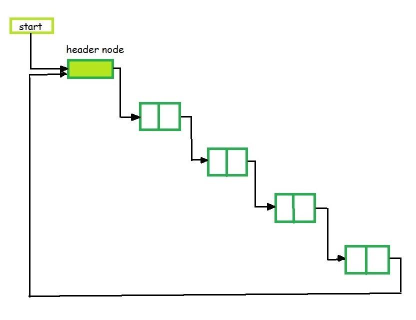
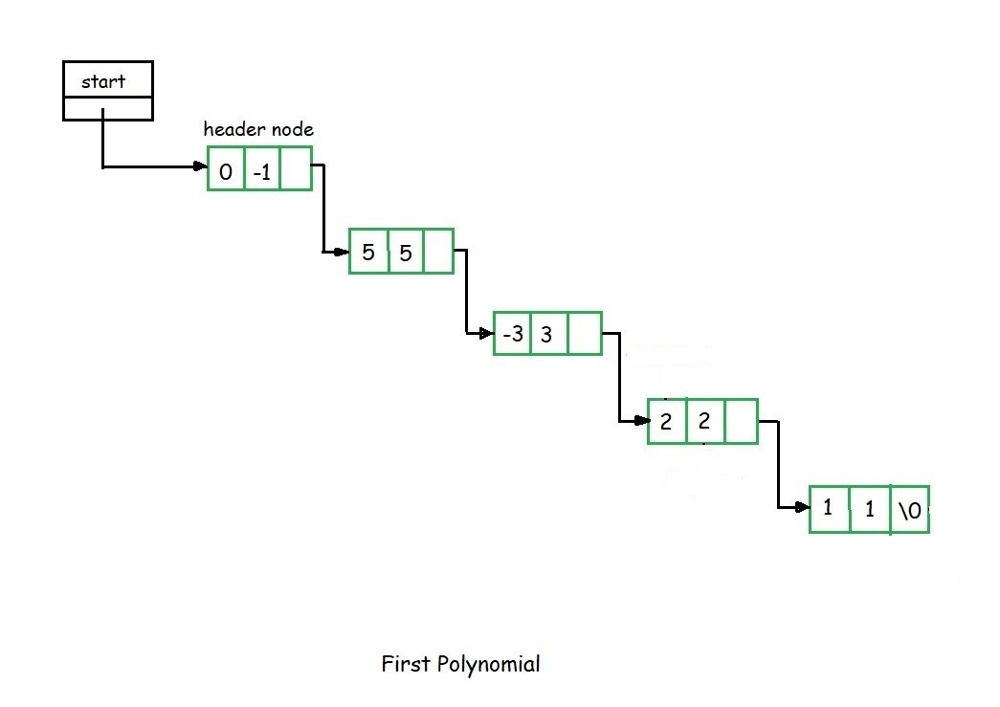
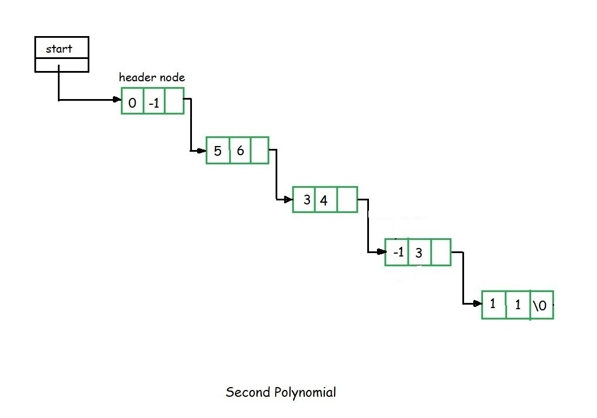
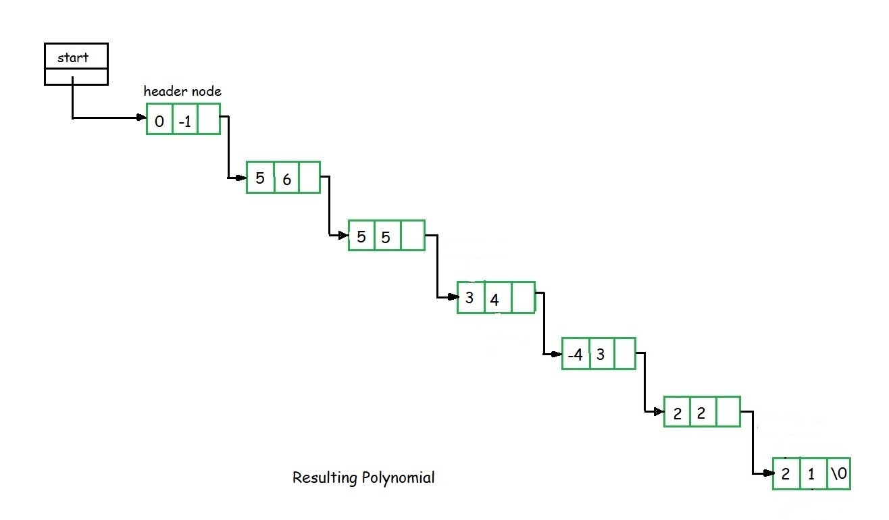
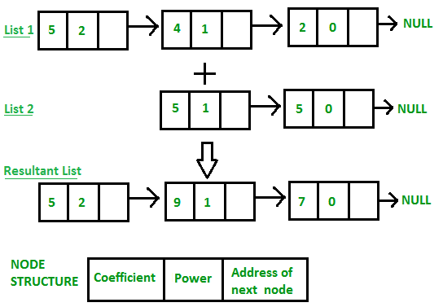

# 1. Header Linked List in C

A header node is a special node that is found at the beginning of the list. A list that contains this type of node, is called the header-linked list. This type of list is useful when information other than that found in each node is needed.

For example, suppose there is an application in which the number of items in a list is often calculated. Usually, a list is always traversed to find the length of the list. However, if the current length is maintained in an additional header node that information can be easily obtained.

## Types of Header Linked List

1. Grounded Header Linked List

It is a list whose last node contains the NULL pointer. In the header linked list the start pointer always points to the header node. __`start -> next = NULL`__ indicates that the grounded header linked list is empty. The operations that are possible on this type of linked list are Insertion, Deletion, and Traversing.


2. Circular Header Linked List

A list in which last node points back to the header node is called circular linked list. The chains do not indicate first or last nodes. In this case, external pointers provide a frame of reference because last node of a circular linked list does not contain the NULL pointer. The possible operations on this type of linked list are Insertion, Deletion and Traversing.



```c
// C program for a Header Linked List
#include <malloc.h>
#include <stdio.h>
  
// Structure of the list
struct link {
    int info;
    struct link* next;
};
  
// Empty List
struct link* start = NULL;
  
// Function to create a header linked list
struct link* create_header_list(int data)
{
  
    // Create a new node
    struct link *new_node, *node;
    new_node = (struct link*)
        malloc(sizeof(struct link));
    new_node->info = data;
    new_node->next = NULL;
  
    // If it is the first node
    if (start == NULL) {
  
        // Initialize the start
        start = (struct link*)
            malloc(sizeof(struct link));
        start->next = new_node;
    }
    else {
  
        // Insert the node in the end
        node = start;
        while (node->next != NULL) {
            node = node->next;
        }
        node->next = new_node;
    }
    return start;
}
  
// Function to display the
// header linked list
struct link* display()
{
    struct link* node;
    node = start;
    node = node->next;
    while (node != NULL) {
        printf("%d ", node->info);
        node = node->next;
    }
    printf("\n");
    return start;
}
  
// Driver code
int main()
{
  
    // Create the list
    create_header_list(11);
    create_header_list(12);
    create_header_list(13);
  
    // Print the list
    display();
    create_header_list(14);
    create_header_list(15);
  
    // Print the list
    display();
  
    return 0;
}
```

```yml
Output:

11 12 13 
11 12 13 14 15
```

### Applications of Header Linked List

#### Polynomials

- The header linked lists are frequently used to maintain the polynomials in memory. The header node is used to represent the zero polynomial.
- Suppose we have $$ F(x) = 5x5 – 3x3 + 2x2 + x1 +10x0 $$
- From the polynomial represented by F(x) it is clear that this polynomial has two parts, __coefficient__ and __exponent__, where, __x__ is __formal parameter__. Hence, we can say that a polynomial is sum of terms, each of which consists of a coefficient and an exponent.
- The computer implementation requires implementing polynomials as a list of pair of coefficient and exponent. Each of these pairs will constitute a structure, so a polynomial will be represented as a list of structures.
- If one wants to represent F(x) with help of linked list then the list will contain 5 nodes. When we link each node we get a linked list structure that represents polynomial __F(x)__.


#### Addition of polynomials

1. To add two polynomials, we need to scan them once.
2. If we find terms with the same exponent in the two polynomials, then we add the coefficients, otherwise, we copy the term of larger exponent into the sum and go on.
3. When we reach at the end of one of the polynomial, then remaining part of the other is copied into the sum.
4. Suppose we have two polynomials as illustrated and we have to perform addition of these polynomials.





5. When we scan first node of the two polynomials, we find that exponential power of first node in the second polynomial is greater than that of first node of the first polynomial.
6. Here the exponent of the first node of the second polynomial is greater hence we have to copy first node of the second polynomial into the sum.
7. Then we consider the first node of the first polynomial and once again first node value of first polynomial is compared with the second node value of the second polynomial.
8. Here the first node exponent value of the first polynomial is greater than the second node exponent value of the second polynomial. We copy the first node of the first polynomial into the sum.
9. Now consider the second node of the first polynomial and compare it with the second node of the second polynomial.
10. Here the exponent value of the second node of the second polynomial is greater than the second node of the first polynomial, hence we copy the second node of the second list into the sum.
11. Now we consider the third node exponent of the second polynomial and compare it with second node exponent value of the first polynomial. We find that both are equal, hence perform addition of their coefficient and copy in to the sum.
12. This process continues till all the nodes of both the polynomial are exhausted. For example after adding the above two polynomials, we get the following resultant polynomial as shown.



# 2. Adding two polynomials using Linked List

Given two polynomial numbers represented by a linked list. Write a function that add these lists means add the coefficients who have same variable powers.

__Example:__


__Input 1:__
$ 1st number = 5x^2 + 4x^1 + 2x^0 $
$ 2nd number = -5x^1 - 5x^0 $
__Output 1:__
$ 5x^2-1x^1-3x^0 $


__Input 2:__
$ 1st number = 5x^3 + 4x^2 + 2x^0 $
$ 2nd number = 5x^1 - 5x^0 $
__Output 2:__
$ 5x^3 + 4x^2 + 5x^1 - 3x^0 $




