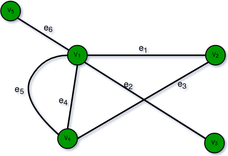

# Introduction

- [Introduction](#introduction)
- [1. Introduction to Graph](#1-introduction-to-graph)
  - [Components of a Graph](#components-of-a-graph)
  - [Types Of Graph](#types-of-graph)
    - [1. Null Graph](#1-null-graph)
    - [2. Trivial Graph](#2-trivial-graph)
    - [3. Undirected Graph](#3-undirected-graph)
    - [4. Directed Graph](#4-directed-graph)
    - [5. Connected Graph](#5-connected-graph)
    - [6. Disconnected Graph](#6-disconnected-graph)
    - [7. Regular Graph](#7-regular-graph)
    - [8. Complete Graph](#8-complete-graph)
    - [9. Cycle Graph](#9-cycle-graph)
    - [10. Cyclic Graph](#10-cyclic-graph)
    - [11. Directed Acyclic Graph](#11-directed-acyclic-graph)
    - [12. Bipartite Graph](#12-bipartite-graph)
    - [13. Weighted Graph](#13-weighted-graph)
  - [Tree v/s Graph](#tree-vs-graph)
  - [Representation of Graphs](#representation-of-graphs)
    - [Comparison between Adjacency Matrix and Adjacency List](#comparison-between-adjacency-matrix-and-adjacency-list)
  - [Basic Operations on Graphs](#basic-operations-on-graphs)
  - [Usage of graphs](#usage-of-graphs)
  - [Real-Life Applications of Graph](#real-life-applications-of-graph)
  - [Summary:](#summary)
- [2. Graph and its representations](#2-graph-and-its-representations)
  - [1. Adjacency Matrix:](#1-adjacency-matrix)
  - [2. Adjacency List:](#2-adjacency-list)
- [3. Types of Graphs](#3-types-of-graphs)
  - [Types of Graphs:](#types-of-graphs)
    - [1. Finite Graphs](#1-finite-graphs)
    - [2. Infinite Graph:](#2-infinite-graph)
    - [3. Trivial Graph:](#3-trivial-graph)
    - [5. Multi Graph:](#5-multi-graph)
    - [6. Null Graph:](#6-null-graph)
    - [7. Complete Graph:](#7-complete-graph)
    - [8. Pseudo Graph:](#8-pseudo-graph)
    - [9. Regular Graph:](#9-regular-graph)
    - [10. Bipartite Graph:](#10-bipartite-graph)
    - [11. Labeled Graph:](#11-labeled-graph)
    - [12. Digraph Graph:](#12-digraph-graph)
    - [13. Subgraph:](#13-subgraph)
    - [14. Connected or Disconnected Graph:](#14-connected-or-disconnected-graph)
    - [15. Cyclic Graph:](#15-cyclic-graph)
    - [16. Types of Subgraphs:](#16-types-of-subgraphs)
- [4. Basic Properties of a Graph](#4-basic-properties-of-a-graph)
  - [1. Distance between two Vertices:](#1-distance-between-two-vertices)
  - [2. The eccentricity of a Vertex:](#2-the-eccentricity-of-a-vertex)
  - [3. Radius of a Connected Graph:](#3-radius-of-a-connected-graph)
  - [4. Diameter of A Connected Graph:](#4-diameter-of-a-connected-graph)
  - [5. Central Point and Centre:](#5-central-point-and-centre)
- [5. Applications, Advantages and Disadvantages of Graph](#5-applications-advantages-and-disadvantages-of-graph)
  - [Graph Representation:](#graph-representation)
  - [Real-Time Applications of Graph:](#real-time-applications-of-graph)
  - [Advantages of Graph:](#advantages-of-graph)
  - [Disadvantages of Graph:](#disadvantages-of-graph)
- [6. Transpose graph](#6-transpose-graph)
- [7. Difference between graph and tree](#7-difference-between-graph-and-tree)


# 1. Introduction to Graph

A Graph is a non-linear data structure consisting of vertices and edges. The vertices are sometimes also referred to as nodes and the edges are lines or arcs that connect any two nodes in the graph. More formally a Graph is composed of a set of vertices( __V__ ) and a set of edges( __E__ ). The graph is denoted by __G(V, E)__.

Graph data structures are a powerful tool for representing and analyzing complex relationships between objects or entities. They are particularly useful in fields such as social network analysis, recommendation systems, and computer networks. In the field of sports data science, graph data structures can be used to analyze and understand the dynamics of team performance and player interactions on the field.

Imagine a game of football as a web of connections, where players are the nodes and their interactions on the field are the edges. This web of connections is exactly what a graph data structure represents, and it’s the key to unlocking insights into team performance and player dynamics in sports.

## Components of a Graph

- __Vertices:__ Vertices are the fundamental units of the graph. Sometimes, vertices are also known as vertex or nodes. Every node/vertex can be labeled or unlabelled.
- __Edges:__ Edges are drawn or used to connect two nodes of the graph. It can be ordered pair of nodes in a directed graph. Edges can connect any two nodes in any possible way. There are no rules. Sometimes, edges are also known as arcs. Every edge can be labelled/unlabelled.


## Types Of Graph

### 1. Null Graph

A graph is known as a null graph if there are no edges in the graph.

### 2. Trivial Graph

Graph having only a single vertex, it is also the smallest graph possible.


### 3. Undirected Graph

A graph in which edges do not have any direction. That is the nodes are unordered pairs in the definition of every edge.

### 4. Directed Graph

A graph in which edge has direction. That is the nodes are ordered pairs in the definition of every edge.


### 5. Connected Graph

The graph in which from one node we can visit any other node in the graph is known as a connected graph. 

### 6. Disconnected Graph

The graph in which at least one node is not reachable from a node is known as a disconnected graph.


### 7. Regular Graph

The graph in which the degree of every vertex is equal to K is called K regular graph.

### 8. Complete Graph

The graph in which from each node there is an edge to each other node.


### 9. Cycle Graph

The graph in which the graph is a cycle in itself, the degree of each vertex is 2. 

### 10. Cyclic Graph

A graph containing at least one cycle is known as a Cyclic graph.


### 11. Directed Acyclic Graph

A Directed Graph that does not contain any cycle. 

### 12. Bipartite Graph

A graph in which vertex can be divided into two sets such that vertex in each set does not contain any edge between them.


### 13. Weighted Graph

- A graph in which the edges are already specified with suitable weight is known as a weighted graph.
- Weighted graphs can be further classified as directed weighted graphs and undirected weighted graphs. 

## Tree v/s Graph

Trees are the restricted types of graphs, just with some more rules. Every tree will always be a graph but not all graphs will be trees. Linked List, Trees, and Heaps all are special cases of graphs.


## Representation of Graphs

There are two ways to store a graph:

- Adjacency Matrix
- Adjacency List

1. Adjacency Matrix

In this method, the graph is stored in the form of the 2D matrix where rows and columns denote vertices. Each entry in the matrix represents the weight of the edge between those vertices. 


2. Adjacency List

This graph is represented as a collection of linked lists. There is an array of pointer which points to the edges connected to that vertex. 


### Comparison between Adjacency Matrix and Adjacency List

When the graph contains a large number of edges then it is good to store it as a matrix because only some entries in the matrix will be empty. An algorithm such as Prim’s and Dijkstra adjacency matrix is used to have less complexity.

|Action	|Adjacency Matrix|Adjacency List|
|---|---|---|
|Adding Edge|O(1)|O(1)|
|Removing an edge|O(1)|O(N)|
|Initializing|O(N*N)|O(N)|

## Basic Operations on Graphs

Below are the basic operations on the graph:

- Insertion of Nodes/Edges in the graph – Insert a node into the graph.
- Deletion of Nodes/Edges in the graph – Delete a node from the graph.
- Searching on Graphs – Search an entity in the graph.
- Traversal of Graphs – Traversing all the nodes in the graph.

## Usage of graphs

- Maps can be represented using graphs and then can be used by computers to provide various services like the shortest path between two cities.
- When various tasks depend on each other then this situation can be represented using a Directed Acyclic graph and we can find the order in which tasks can be performed using topological sort.
- State Transition Diagram represents what can be the legal moves from current states. In-game of tic tac toe this can be used.

## Real-Life Applications of Graph


__Following are the real-life applications:__

- Graph data structures can be used to represent the interactions between players on a team, such as passes, shots, and tackles. Analyzing these interactions can provide insights into team dynamics and areas for improvement.
- Commonly used to represent social networks, such as networks of friends on social media.
- Graphs can be used to represent the topology of computer networks, such as the connections between routers and switches.
- Graphs are used to represent the connections between different places in a transportation network, such as roads and airports.
- __Neural Networks:__ Vertices represent neurons and edges represent the synapses between them. Neural networks are used to understand how our brain works and how connections change when we learn. The human brain has about 10^11 neurons and close to 10^15 synapses.
- __Compilers:__ Graphs are used extensively in compilers. They can be used for type inference, for so-called data flow analysis, register allocation, and many other purposes. They are also used in specialized compilers, such as query optimization in database languages.
- __Robot planning:__ Vertices represent states the robot can be in and the edges the possible transitions between the states. Such graph plans are used, for example, in planning paths for autonomous vehicles.


__When to use Graphs:__

- When you need to represent and analyze the relationships between different objects or entities. 
- When you need to perform network analysis.
- When you need to identify key players, influencers or bottlenecks in a system.
- When you need to make predictions or recommendations.

## Summary:

- Graph data structures are a powerful tool for representing and analyzing relationships between objects or entities.
- Graphs can be used to represent the interactions between different objects or entities, and then analyze these interactions to identify patterns, clusters, communities, key players, influencers, bottlenecks and anomalies. 
- In sports data science, graph data structures can be used to analyze and understand the dynamics of team performance and player interactions on the field.
- They can be used in a variety of fields such as Sports, Social media, transportation, cybersecurity and many more.

# 2. Graph and its representations

A graph is a data structure that consists of the following two components: 
1. A finite set of vertices also called as nodes. 
2. A finite set of ordered pair of the form (u, v) called as edge. The pair is ordered because (u, v) is not the same as (v, u) in case of a directed graph(di-graph). The pair of the form (u, v) indicates that there is an edge from vertex u to vertex v. The edges may contain weight/value/cost.
Graphs are used to represent many real-life applications: Graphs are used to represent networks. The networks may include paths in a city or telephone network or circuit network. Graphs are also used in social networks like linkedIn, Facebook. For example, in Facebook, each person is represented with a vertex(or node). Each node is a structure and contains information like person id, name, gender, and locale. See this for more applications of graph. 
Following is an example of an undirected graph with 5 vertices. 


The following two are the most commonly used representations of a graph. 
1. Adjacency Matrix 
2. Adjacency List 
There are other representations also like, Incidence Matrix and Incidence List. The choice of graph representation is situation-specific. It totally depends on the type of operations to be performed and ease of use.

## 1. Adjacency Matrix:
Adjacency Matrix is a 2D array of size V x V where V is the number of vertices in a graph. Let the 2D array be adj[][], a slot adj[i][j] = 1 indicates that there is an edge from vertex i to vertex j. Adjacency matrix for undirected graph is always symmetric. Adjacency Matrix is also used to represent weighted graphs. If adj[i][j] = w, then there is an edge from vertex i to vertex j with weight w. 

In case of an undirected graph, we need to show that there is an edge from vertex i  to vertex j and vice versa. In code, we assign adj[i][j] = 1  and adj[j][i] = 1

In case of a directed graph, if there is an edge from vertex i to vertex j then we just assign adj[i][j]=1

The adjacency matrix for the above example graph is: 


__Pros:__ Representation is easier to implement and follow. Removing an edge takes O(1) time. Queries like whether there is an edge from vertex ‘u’ to vertex ‘v’ are efficient and can be done O(1).
__Cons:__ Consumes more space O(V^2). Even if the graph is sparse(contains less number of edges), it consumes the same space. Adding a vertex is O(V^2) time.  Computing all neighbors of a vertex takes O(V) time (Not efficient).

__Implementation of taking input for adjacency matrix:__


```py
# For Undirected Graph
if __name__ == '__main__':
    # v is the number of vertices
    # edge is the edges
    vertices, edges = map(int, input().split())
    adjacencyMatrix = [[0 for i in range(vertices)] for j in range(vertices)]
    for i in range(vertices):
        u, v = map(int, input().split())
        adjacencyMatrix[u][v] = 1
        adjacencyMatrix[v][u] = 1
        # for a directed graph we only need to store from u to, we just assign
        # adjacency[u][v] = 1
```

```py
# For directed Graph
if __name__ == '__main__':
    vertices, edges = map(int, input().split())
    adjacencyMatrix = [[0 for i in range(vertices)] for j in range(vertices)]
    for i in range(vertices):
        u, v = map(int, input().split())
        adjacencyMatrix[u][v] = 1
```

## 2. Adjacency List:

An array of lists is used. The size of the array is equal to the number of vertices. Let the array be an array[]. An entry __`array[i]`__ represents the list of vertices adjacent to the ith vertex. This representation can also be used to represent a weighted graph. The weights of edges can be represented as lists of pairs. Following is the adjacency list representation of the above graph. 


Note that in the below implementation, we use dynamic arrays (vector in C++/ArrayList in Java) to represent adjacency lists instead of the linked list. The vector implementation has advantages of cache friendliness. 

```py
# A class represents the adjacency list of the node
class adjNode:
    def __init__(self, data) -> None:
        self.vertex = data
        self.next = None

# A class is represents a graph. A graph is the list of the adjacency lists.

class graph:
    def __init__(self, vertices) -> None:
        self.v = vertices
        self.graph = [None] * self.v
    
    def add_edge(self, src, dest):
        # Adding source node
        node = adjNode(dest)
        node.next = self.graph[src]
        self.graph[src] = node
        
        # Adding destination node
        node = adjNode(src)
        node.next = self.graph[dest]
        self.graph[dest] = node
    
    def print_graph(self):
        for i in range(self.v):
            print('Adjacency List of vertex {}\n head'.format(i), end='')
            temp = self.graph[i]
            while temp:
                print(' -> {}'.format(temp.vertex), end='')
                temp = temp.next
            print('\n')

if __name__ == '__main__':
    v = 5
    Graph = graph(v)
    Graph.add_edge(0, 1)
    Graph.add_edge(0, 4)
    Graph.add_edge(1, 2)
    Graph.add_edge(1, 3)
    Graph.add_edge(1, 4)
    Graph.add_edge(2, 3)
    Graph.add_edge(3, 4)
    
    Graph.print_graph()
```

```yml
Adjacency List of vertex 0
 head -> 4 -> 1

Adjacency List of vertex 1
 head -> 4 -> 3 -> 2 -> 0

Adjacency List of vertex 2
 head -> 3 -> 1

Adjacency List of vertex 3
 head -> 4 -> 2 -> 1

Adjacency List of vertex 4
 head -> 3 -> 1 -> 0
```

__Pros:__ Saves space O(|V|+|E|). In the worst case, there can be C(V, 2) number of edges in a graph thus consuming O(V^2) space. Adding a vertex is easier. Computing all neighbors of a vertex takes optimal time.
__Cons:__ Queries like whether there is an edge from vertex u to vertex v are not efficient and can be done O(V).

In Real-life problems,  graphs are sparse(|E| <<|V|2). That’s why adjacency lists Data structure is commonly used for storing graphs. Adjacency matrix will enforce (|V|2) bound on time complexity for such algorithms. 

# 3. Types of Graphs

A __Graph__ is a non-linear data structure consisting of nodes and edges. The nodes are sometimes also referred to as vertices and the edges are lines or arcs that connect any two nodes in the graph. More formally a Graph can be defined as, A Graph consisting of a finite set of vertices(or nodes) and a set of edges that connect a pair of nodes.

## Types of Graphs:

### 1. Finite Graphs

A graph is said to be finite if it has a finite number of vertices and a finite number of edges. A finite graph is a graph with a finite number of vertices and edges. In other words, both the number of vertices and the number of edges in a finite graph are limited and can be counted. Finite graphs are often used to model real-world situations, where there is a limited number of objects and relationships between the


### 2. Infinite Graph: 

A graph is said to be infinite if it has an infinite number of vertices as well as an infinite number of edges. 


### 3. Trivial Graph: 

A graph is said to be trivial if a finite graph contains only one vertex and no edge. A trivial graph is a graph with only one vertex and no edges. It is also known as a singleton graph or a single vertex graph. A trivial graph is the simplest type of graph and is often used as a starting point for building more complex graphs. In graph theory, trivial graphs are considered to be a degenerate case and are not typically studied in detail


4. Simple Graph:

A simple graph is a graph that does not contain more than one edge between the pair of vertices. A simple railway track connecting different cities is an example of a simple graph.


### 5. Multi Graph:

Any graph which contains some parallel edges but doesn’t contain any self-loop is called a multigraph. For example a Road Map. 

- __Parallel Edges:__ If two vertices are connected with more than one edge then such edges are called parallel edges that are many routes but one destination.
- __Loop:__ An edge of a graph that starts from a vertex and ends at the same vertex is called a loop or a self-loop.



### 6. Null Graph:

A graph of order n and size zero is a graph where there are only isolated vertices with no edges connecting any pair of vertices.A null graph is a graph with no edges. In other words, it is a graph with only vertices and no connections between them. A null graph can also be referred to as an edgeless graph, an isolated graph, or a discrete graph


### 7. Complete Graph:

A simple graph with n vertices is called a complete graph if the degree of each vertex is n-1, that is, one vertex is attached with n-1 edges or the rest of the vertices in the graph. A complete graph is also called Full Graph. 


### 8. Pseudo Graph:

A graph G with a self-loop and some multiple edges is called a pseudo graph. A pseudograph is a type of graph that allows for the existence of loops (edges that connect a vertex to itself) and multiple edges (more than one edge connecting two vertices). In contrast, a simple graph is a graph that does not allow for loops or multiple edges. 


### 9. Regular Graph:

A simple graph is said to be regular if all vertices of graph G are of equal degree. All complete graphs are regular but vice versa is not possible. A regular graph is a type of undirected graph where every vertex has the same number of edges or neighbors. In other words, if a graph is regular, then every vertex has the same degree. 


### 10. Bipartite Graph:

A graph G = (V, E) is said to be a bipartite graph if its vertex set V(G) can be partitioned into two non-empty disjoint subsets. V1(G) and V2(G) in such a way that each edge e of E(G) has one end in V1(G) and another end in V2(G). The partition V1 U V2 = V is called Bipartite of G. Here in the figure: V1(G)={V5, V4, V3} and V2(G)={V1, V2} 


### 11. Labeled Graph:

If the vertices and edges of a graph are labeled with name, date, or weight then it is called a labeled graph. It is also called Weighted Graph. 


### 12. Digraph Graph:

A graph G = (V, E) with a mapping f such that every edge maps onto some ordered pair of vertices (Vi, Vj) are called a Digraph. It is also called Directed Graph. The ordered pair (Vi, Vj) means an edge between Vi and Vj with an arrow directed from Vi to Vj. Here in the figure: e1 = (V1, V2) e2 = (V2, V3) e4 = (V2, V4) 


### 13. Subgraph:

A graph G1 = (V1, E1) is called a subgraph of a graph G(V, E) if V1(G) is a subset of V(G) and E1(G) is a subset of E(G) such that each edge of G1 has same end vertices as in G. 


### 14. Connected or Disconnected Graph:

Graph G is said to be connected if any pair of vertices (Vi, Vj) of a graph G is reachable from one another. Or a graph is said to be connected if there exists at least one path between each and every pair of vertices in graph G, otherwise, it is disconnected. A null graph with n vertices is a disconnected graph consisting of n components. Each component consists of one vertex and no edge. 


### 15. Cyclic Graph:

A graph G consisting of n vertices and n> = 3 that is V1, V2, V3- – – – Vn and edges (V1, V2), (V2, V3), (V3, V4)- – – – (Vn, V1) are called cyclic graph. 


### 16. Types of Subgraphs:

- Vertex disjoint subgraph: Any two graph G1 = (V1, E1) and G2 = (V2, E2) are said to be vertex disjoint of a graph G = (V, E) if V1(G1) intersection V2(G2) = null. In the figure, there is no common vertex between G1 and G2.
- Edge disjoint subgraph: A subgraph is said to be edge-disjoint if E1(G1) intersection E2(G2) = null. In the figure, there is no common edge between G1 and G2.

__Note:__ Edge disjoint subgraph may have vertices in common but a vertex disjoint graph cannot have a common edge, so the vertex disjoint subgraph will always be an edge-disjoint subgraph.

# 4. Basic Properties of a Graph

A Graph is a non-linear data structure consisting of nodes and edges. The nodes are sometimes also referred to as vertices and the edges are lines or arcs that connect any two nodes in the graph. Properties of Graphs are basically used for the characterization of graphs depending on their structures. We defined these properties in specific terms that pertain to the domain of graph theory. In this article, we are going to discuss some properties of Graphs these are as follows:

## 1. Distance between two Vertices:

It is basically the number of edges that are available in the shortest path between vertex A and vertex B.If there is more than one edge which is used to connect two vertices then we basically considered the shortest path as the distance between these two vertices.

```yml
Notation used :
d(A, B)
here function d is basically showing the distance between vertex A and vertex B.
```

__Let us understand this using an example:__


In the above diagram, let’s try to find the distance between vertices b and d.

```yml
d(b, d)
We can go from vertex b to vertex d in different ways such as
1.ba, af, fe, ed here the d(b, d) will be 4.
2.ba, af, fc, cd here the d(b, d) will be 4.
3.bc, cf, fe, ed here the d(b, d) will be 4.
4.bc, cd here the d(b, d) will be 2.
hence the minimum distance between vertex b and vertex d is 2.
```

## 2. The eccentricity of a Vertex:

Maximum distance from a vertex to all other vertices is considered as the Eccentricity of that vertex.

```yml
Notation used:
e(V)
here e(v) determines the eccentricity of vertex V.
```

Let us try to understand this using following example.


```yml
From the above diagram lets try to find the eccentricity of vertex b.
e(b)
d(b, a)=1
d(b, c)=1
d(b, d)=2
d(b, e)=3
d(b, f)=2
d(b, g)=2
Hence the eccentricity of vertex b is 3
```

## 3. Radius of a Connected Graph:

The minimum value of eccentricity from all vertices is basically considered as the radius of connected graph.

```yml
Notation used:
r(G)
here G is the connected graph.
```

Let us try to understand this using following example. 


```yml
From the above diagram:
r(G) is 2.
Because the minimum value of eccentricity from all vertices is 2.
```

## 4. Diameter of A Connected Graph:

Unlike the radius of the connected graph here we basically used the maximum value of eccentricity from all vertices to determine the diameter of the graph.

```yml
Notation used:
d(G)
where G is the connected graph.
```

Let us try to understand this using following example. 


```yml
From the above diagram:
d(G) is 3.
Because the maximum value of eccentricity from all vertices is 3.
```

## 5. Central Point and Centre:

The vertex having minimum eccentricity is considered as the central point of the graph.And the sets of all central point is considered as the centre of Graph.

```yml
if
e(V)=r(G)
then v is the central point.
```

Let us try to understand this using following example. 


```yml
In the above diagram the central point will be f.
because 
e(f)=r(G)=2
hence f is considered as the central point of graph.
Hence f is also the centre of the graph.
```

# 5. Applications, Advantages and Disadvantages of Graph

__Graph__ is a non-linear data structure that contains nodes (vertices) and edges. A graph is a collection of set of vertices and edges (formed by connecting two vertices). A graph is defined as G = {V, E} where V is the set of vertices and E is the set of edges. 

Graphs can be used to model a wide variety of real-world problems, including social networks, transportation networks, and communication networks. They can be represented in various ways, such as by a set of vertices and a set of edges, or by a matrix or an adjacency list. The two most common types of graphs are directed and undirected graphs.

## Graph Representation:

Graph can be represented in the following ways:

1. __Set Representation:__ Set representation of a graph involves two sets: Set of vertices V = {V1, V2, V3, V4} and set of edges E = {{V1, V2}, {V2, V3}, {V3, V4}, {V4, V1}}. This representation is efficient for memory but does not allow parallel edges.
2. __Sequential Representation:__ This representation of a graph can be represented by means of matrices: Adjacency Matrix, Incidence matrix and Path matrix.
   - __Adjacency Matrix:__ This matrix includes information about the adjacent nodes. Here, aij = 1 if there is an edge from Vi to Vj otherwise 0. It is a matrix of order V×V.
   - __Incidence Matrix:__ This matrix includes information about the incidence of edges on the nodes. Here, aij = 1 if the jth edge Ej is incident on ith vertex Vi otherwise 0. It is a matrix of order V×E.
   - __Path Matrix:__ This matrix includes information about the simple path between two vertices. Here, Pij = 1 if there is a path from Vi to Vj otherwise 0. It is also called as reachability matrix of graph G.  
3. __Linked Representation:__ This representation gives the information about the nodes to which a specific node is connected i.e. adjacency lists. This representation gives the adjacency lists of the vertices with the help of array and linked lists. In the adjacency lists, the vertices which are connected with the specific vertex are arranged in the form of lists which is connected to that vertex.

## Real-Time Applications of Graph:

- Graphs are used to represent flow of control in computers.
- Graphs are used in social networking sites where users act as nodes and connection between them acts as edges.
- In an operating system, graphs are used as resource allocation graphs.
- Graphs are used in Google maps to find the shortest route.
- Graphs are also used in airlines system for effective route optimization. 
- In-state transition diagrams, the graph is used to represent their states and their transition.
- In transportation, graphs are used to find the shortest path.
- In circuits, graphs can be used to represent circuit points as nodes and wires as edges.
- Graphs are used in solving puzzles with only one solution, such as mazes.
- Graphs are used in computer networks for Peer to peer (P2P) applications.
- Graphs basically in the form of DAG(Directed acyclic graph) are used as alternative to blockchain for cryptocurrency. For example crypto like  IOTA, Nano are mainly based on DAG.

## Advantages of Graph:

- By using graphs we can easily find the shortest path, neighbors of the nodes, and many more.
- Graphs are used to implement algorithms like DFS and BFS.
- It is used to find minimum spanning tree which has many practical applications.
- It helps in organizing data.
- Because of its non-linear structure, helps in understanding complex problems and their visualization.
- Graphs can handle large amounts of data and can easily be distributed across multiple machines.
- Graphs can be used to model many different types of real-world relationships and connections.
- Graphs are well suited to handle sparse data.
- Graphs can support multiple types of relationships between entities, such as one-to-one, one-to-many, and many-to-many.

## Disadvantages of Graph:

- Graphs use lots of pointers which can be complex to handle.
- It can have large memory complexity.
- If the graph is represented with an adjacency matrix then it does not allow parallel edges and multiplication of the graph is also difficult. 
- Some graph algorithms have high time complexity, which can slow down the performance of a system.
- Graphs can have cyclic relationships, which can make it difficult to traverse or process the data.
- Graphs may not have built-in support for advanced analytics such as machine learning or data mining.

# 6. Transpose graph

__Transpose__ of a directed graph G is another directed graph on the same set of vertices with all of the edges reversed compared to the orientation of the corresponding edges in G. That is, if G contains an edge (u, v) then the converse/transpose/reverse of G contains an edge (v, u) and vice versa. Given a graph (represented as adjacency list), we need to find another graph which is the transpose of the given graph. 

__Example:__


```yml
Input : figure (i) is the input graph.
Output : figure (ii) is the transpose graph of the given graph.
```

We traverse the adjacency list and as we find a vertex v in the adjacency list of vertex u which indicates an edge from u to v in main graph, we just add an edge from v to u in the transpose graph i.e. add u in the adjacency list of vertex v of the new graph. Thus traversing lists of all vertices of main graph we can get the transpose graph. Thus the total time complexity of the algorithm is O(V+E) where V is number of vertices of graph and E is the number of edges of the graph. Note : It is simple to get the transpose of a graph which is stored in adjacency matrix format, you just need to get the transpose of that matrix. 

__Implementation:__

```py
# Python3 program to find transpose of a graph.

# function to add an edge from vertex
# source to vertex dest
def addEdge(adj, src, dest):
	adj[src].append(dest)

# function to print adjacency list
# of a graph
def displayGraph(adj, v):
	for i in range(v):
		print(i, "--> ", end = "")
		for j in range(len(adj[i])):
			print(adj[i][j], end = " ")
		print()

# function to get Transpose of a graph
# taking adjacency list of given graph
# and that of Transpose graph
def transposeGraph(adj, transpose, v):
	
	# traverse the adjacency list of given
	# graph and for each edge (u, v) add
	# an edge (v, u) in the transpose graph's
	# adjacency list
	for i in range(v):
		for j in range(len(adj[i])):
			addEdge(transpose, adj[i][j], i)

# Driver Code
if __name__ == '__main__':

	v = 5
	adj = [[] for i in range(v)]
	addEdge(adj, 0, 1)
	addEdge(adj, 0, 4)
	addEdge(adj, 0, 3)
	addEdge(adj, 2, 0)
	addEdge(adj, 3, 2)
	addEdge(adj, 4, 1)
	addEdge(adj, 4, 3)

	# Finding transpose of graph represented
	# by adjacency list adj[]
	transpose = [[]for i in range(v)]
	transposeGraph(adj, transpose, v)

	# displaying adjacency list of
	# transpose graph i.e. b
	displayGraph(transpose, v)

# This code is contributed by PranchalK
```

```yml
0--> 2  
1--> 0  4  
2--> 3  
3--> 0  4  
4--> 0  
```

# 7. Difference between graph and tree

__Graph :__

A graph is a collection of two sets V and E where V is a finite non-empty set of vertices and E is a finite non-empty set of edges.

- Vertices are nothing but the nodes in the graph.
- Two adjacent vertices are joined by edges.
- Any graph is denoted as G = {V, E}.

__For Example:__


G = {{V1, V2, V3, V4, V5, V6}, {E1, E2, E3, E4, E5, E6, E7}} 

__Tree :__

A tree is a finite set of one or more nodes such that –

- There is a specially designated node called root.
- The remaining nodes are partitioned into n>=0 disjoint sets T1, T2, T3, …, Tn 
- where T1, T2, T3, …, Tn are called the subtrees of the root.

The concept of a tree is represented by following Fig.


__Graph vs Tree__

|The basis of Comparison|Graph|Tree|
|---|---|---|
|Definition|Graph is a non-linear data structure.|Tree is a non-linear data structure.|
|Structure|It is a collection of vertices/nodes and edges.|It is a collection of nodes and edges.|
|Edges|Each node can have any number of edges.|If there is n nodes then there would be n-1 number of edges|
|Types of Edges|They can be directed or undirected|They are always directed|
|Root node|There is no unique node called root in graph.|There is a unique node called root(parent) node in trees.|
|Loop Formation|A cycle can be formed.|There will not be any cycle.|
|Traversal|For graph traversal, we use Breadth-First Search (BFS), and Depth-First Search (DFS).|We traverse a tree using in-order, pre-order, or post-order traversal methods.|
|Applications|For finding shortest path in networking graph is used.|For game trees, decision trees, the tree is used.|
