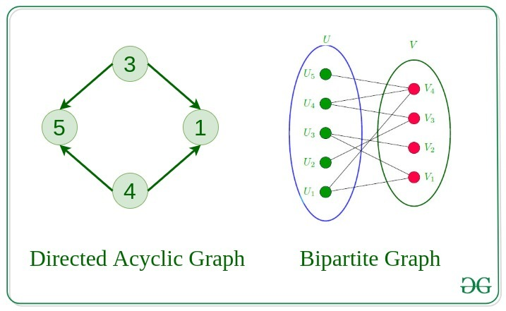

# 1. Introduction to Graph

A Graph is a non-linear data structure consisting of vertices and edges. The vertices are sometimes also referred to as nodes and the edges are lines or arcs that connect any two nodes in the graph. More formally a Graph is composed of a set of vertices( __V__ ) and a set of edges( __E__ ). The graph is denoted by __G(V, E)__.

Graph data structures are a powerful tool for representing and analyzing complex relationships between objects or entities. They are particularly useful in fields such as social network analysis, recommendation systems, and computer networks. In the field of sports data science, graph data structures can be used to analyze and understand the dynamics of team performance and player interactions on the field.

Imagine a game of football as a web of connections, where players are the nodes and their interactions on the field are the edges. This web of connections is exactly what a graph data structure represents, and it’s the key to unlocking insights into team performance and player dynamics in sports.

## Components of a Graph

- __Vertices:__ Vertices are the fundamental units of the graph. Sometimes, vertices are also known as vertex or nodes. Every node/vertex can be labeled or unlabelled.
- __Edges:__ Edges are drawn or used to connect two nodes of the graph. It can be ordered pair of nodes in a directed graph. Edges can connect any two nodes in any possible way. There are no rules. Sometimes, edges are also known as arcs. Every edge can be labelled/unlabelled.

## Types Of Graph

### 1. Null Graph

A graph is known as a null graph if there are no edges in the graph.

### 2. Trivial Graph

Graph having only a single vertex, it is also the smallest graph possible.

### 3. Undirected Graph

A graph in which edges do not have any direction. That is the nodes are unordered pairs in the definition of every edge.

### 4. Directed Graph

A graph in which edge has direction. That is the nodes are ordered pairs in the definition of every edge.

### 5. Connected Graph

The graph in which from one node we can visit any other node in the graph is known as a connected graph. 

### 6. Disconnected Graph

The graph in which at least one node is not reachable from a node is known as a disconnected graph.

### 7. Regular Graph

The graph in which the degree of every vertex is equal to K is called K regular graph.

### 8. Complete Graph

The graph in which from each node there is an edge to each other node.

### 9. Cycle Graph

The graph in which the graph is a cycle in itself, the degree of each vertex is 2. 

### 10. Cyclic Graph

A graph containing at least one cycle is known as a Cyclic graph.

### 11. Directed Acyclic Graph

A Directed Graph that does not contain any cycle. 

### 12. Bipartite Graph

A graph in which vertex can be divided into two sets such that vertex in each set does not contain any edge between them.

### 13. Weighted Graph

- A graph in which the edges are already specified with suitable weight is known as a weighted graph.
- Weighted graphs can be further classified as directed weighted graphs and undirected weighted graphs. 

## Tree v/s Graph

Trees are the restricted types of graphs, just with some more rules. Every tree will always be a graph but not all graphs will be trees. Linked List, Trees, and Heaps all are special cases of graphs.

## Representation of Graphs

There are two ways to store a graph:

- Adjacency Matrix
- Adjacency List

1. Adjacency Matrix

In this method, the graph is stored in the form of the 2D matrix where rows and columns denote vertices. Each entry in the matrix represents the weight of the edge between those vertices. 

2. Adjacency Matrix

In this method, the graph is stored in the form of the 2D matrix where rows and columns denote vertices. Each entry in the matrix represents the weight of the edge between those vertices.

### Comparison between Adjacency Matrix and Adjacency List

When the graph contains a large number of edges then it is good to store it as a matrix because only some entries in the matrix will be empty. An algorithm such as Prim’s and Dijkstra adjacency matrix is used to have less complexity.

|Action	|Adjacency Matrix|Adjacency List|
|---|---|---|
|Adding Edge|O(1)|O(1)|
|Removing an edge|O(1)|O(N)|
|Initializing|O(N*N)|O(N)|

## Basic Operations on Graphs

Below are the basic operations on the graph:

- Insertion of Nodes/Edges in the graph – Insert a node into the graph.
- Deletion of Nodes/Edges in the graph – Delete a node from the graph.
- Searching on Graphs – Search an entity in the graph.
- Traversal of Graphs – Traversing all the nodes in the graph.

## Usage of graphs

- Maps can be represented using graphs and then can be used by computers to provide various services like the shortest path between two cities.
- When various tasks depend on each other then this situation can be represented using a Directed Acyclic graph and we can find the order in which tasks can be performed using topological sort.
- State Transition Diagram represents what can be the legal moves from current states. In-game of tic tac toe this can be used.

## Real-Life Applications of Graph

__Following are the real-life applications:__

- Graph data structures can be used to represent the interactions between players on a team, such as passes, shots, and tackles. Analyzing these interactions can provide insights into team dynamics and areas for improvement.
- Commonly used to represent social networks, such as networks of friends on social media.
- Graphs can be used to represent the topology of computer networks, such as the connections between routers and switches.
- Graphs are used to represent the connections between different places in a transportation network, such as roads and airports.
- __Neural Networks:__ Vertices represent neurons and edges represent the synapses between them. Neural networks are used to understand how our brain works and how connections change when we learn. The human brain has about 10^11 neurons and close to 10^15 synapses.
- __Compilers:__ Graphs are used extensively in compilers. They can be used for type inference, for so-called data flow analysis, register allocation, and many other purposes. They are also used in specialized compilers, such as query optimization in database languages.
- __Robot planning:__ Vertices represent states the robot can be in and the edges the possible transitions between the states. Such graph plans are used, for example, in planning paths for autonomous vehicles.

__When to use Graphs:__

- When you need to represent and analyze the relationships between different objects or entities. 
- When you need to perform network analysis.
- When you need to identify key players, influencers or bottlenecks in a system.
- When you need to make predictions or recommendations.

## Summary:

- Graph data structures are a powerful tool for representing and analyzing relationships between objects or entities.
- Graphs can be used to represent the interactions between different objects or entities, and then analyze these interactions to identify patterns, clusters, communities, key players, influencers, bottlenecks and anomalies. 
- In sports data science, graph data structures can be used to analyze and understand the dynamics of team performance and player interactions on the field.
- They can be used in a variety of fields such as Sports, Social media, transportation, cybersecurity and many more.

# 2. Graph and its representations

A graph is a data structure that consists of the following two components: 
1. A finite set of vertices also called as nodes. 
2. A finite set of ordered pair of the form (u, v) called as edge. The pair is ordered because (u, v) is not the same as (v, u) in case of a directed graph(di-graph). The pair of the form (u, v) indicates that there is an edge from vertex u to vertex v. The edges may contain weight/value/cost.
Graphs are used to represent many real-life applications: Graphs are used to represent networks. The networks may include paths in a city or telephone network or circuit network. Graphs are also used in social networks like linkedIn, Facebook. For example, in Facebook, each person is represented with a vertex(or node). Each node is a structure and contains information like person id, name, gender, and locale. See this for more applications of graph. 
Following is an example of an undirected graph with 5 vertices. 

The following two are the most commonly used representations of a graph. 
1. Adjacency Matrix 
2. Adjacency List 
There are other representations also like, Incidence Matrix and Incidence List. The choice of graph representation is situation-specific. It totally depends on the type of operations to be performed and ease of use. 
Adjacency Matrix: 
Adjacency Matrix is a 2D array of size V x V where V is the number of vertices in a graph. Let the 2D array be adj[][], a slot adj[i][j] = 1 indicates that there is an edge from vertex i to vertex j. Adjacency matrix for undirected graph is always symmetric. Adjacency Matrix is also used to represent weighted graphs. If adj[i][j] = w, then there is an edge from vertex i to vertex j with weight w. 

In case of an undirected graph, we need to show that there is an edge from vertex i  to vertex j and vice versa. In code, we assign adj[i][j] = 1  and adj[j][i] = 1

In case of a directed graph, if there is an edge from vertex i to vertex j then we just assign adj[i][j]=1

The adjacency matrix for the above example graph is: 

