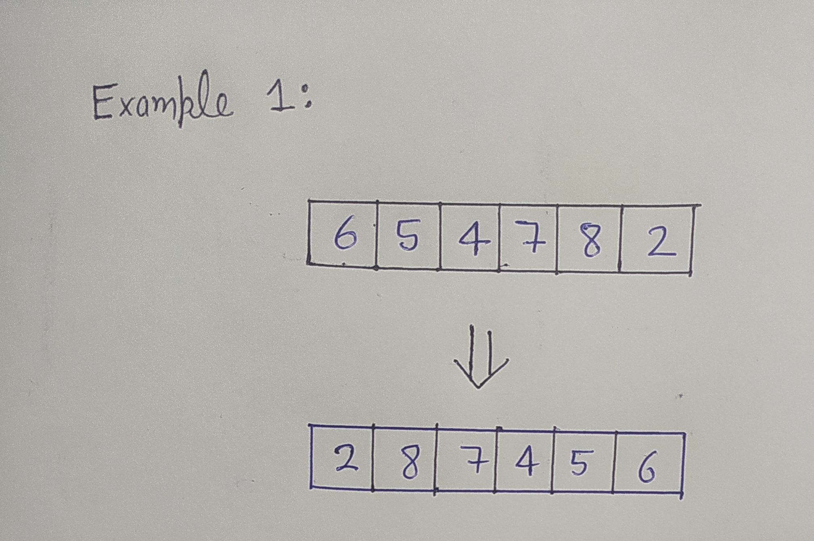
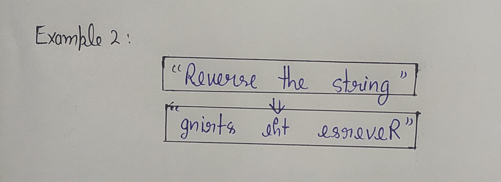
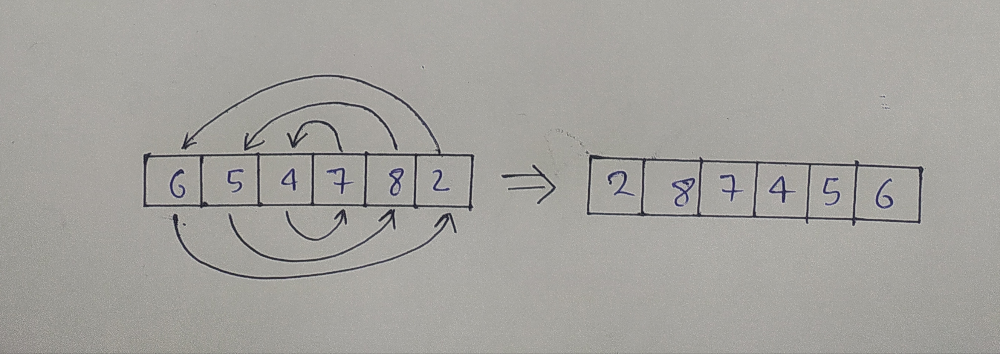

# 1. Reverse the array

- You have given a array or string. You have to return reverse of the array.

### Examples 1:

|6|5|4|7|8|2|
|---|---|---|---|---|---|



### Examples 2:

```py
string = "reverse this string"
```



### Approach 1: swap by two pointers



__Iterative:__
```py
# Iterative - O(n)
def reverseArray(array):
    start, end = 0, len(array)-1
    # you don't need to reverse at the equal index on odd length
    while start < end:
        array[start], array[end] = array[end], array[start]
        start += 1
        end -= 1

array = [6, 5, 4, 7, 8, 2]
print("Original Array: ",array)
reverseArray(array)
print("Reverse Array: ",array)

```

__Recursive:__
```py
# Recursive - O(n) and call stack
def reverseArray(array, start, end):
    if start >= end:
        return None
    else:
        array[start], array[end] = array[end], array[start]
        return reverseArray(array, start+1, end-1)

array = [9, 3, 4, 7, 8, 1]
start, end = 0, len(array)-1
print("Original Array: ", array)
reverseArray(array, start, end)
print("Reversed Array: ",array)
```

### Approach 2: using python slicing

```py
# Python Slicing - O(n)
def reverseArray(array):
    return array[ : : -1]
array = [3, 5, 7, 9, 10]
print("Original Array: ", array)
result = reverseArray(array)
print("Reversed Array: ",result)
```
### Approach 3: using reverse function

```py
# reverse function - O(n log n)
def reverseArray(array):
    array.reverse()
array = [32, 45, 65, 67, 22]
print("Original Array: ",array)
reverseArray(array)
print("Reversed Array: ", array)
```
